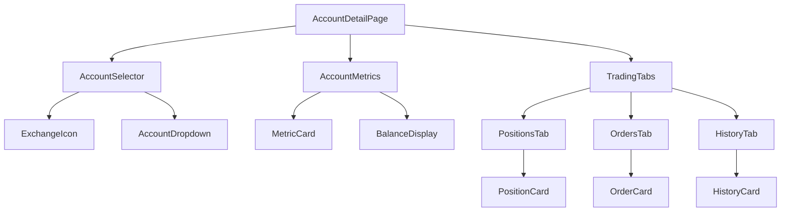
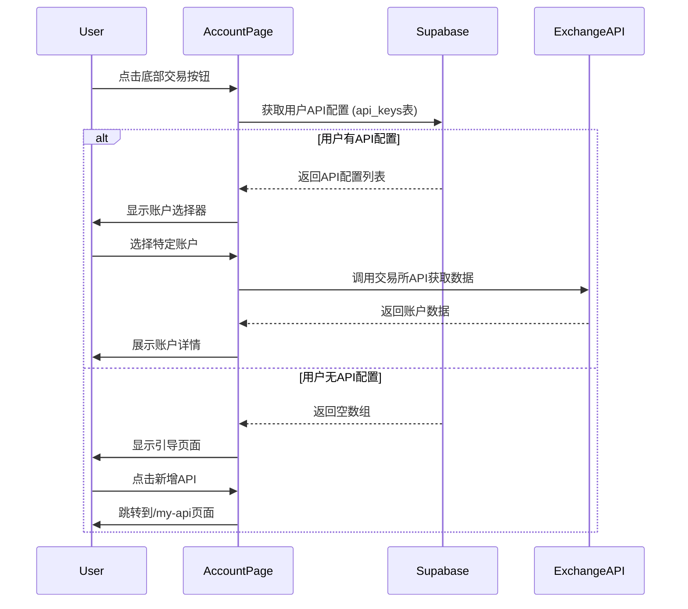

# 账户详情页设计文档

## 概述

账户详情页是用户查看具体交易账户信息和交易状态的核心页面，通过底部导航栏的交易按钮进入。该页面需要整合"我的API"的真实数据，替换当前的静态数据，并添加用户无API时的引导功能。

## 现状分析

当前 `/my-account/page.tsx` 已存在基础功能：
- ✅ 底部导航栏交易按钮入口
- ✅ 账户选择器界面
- ✅ 账户指标展示区域
- ✅ 挂单/持仓标签页
- ❌ 静态账户数据，未集成API
- ❌ 缺少无API时的引导页面

## 技术架构

### 组件层次结构



### 数据流架构



## 界面设计

### 页面布局

#### 1. 页面头部（有API时）
- **账户选择器**: 显示当前选中的账户名称和交易所图标
- **下拉菜单**: 展示所有运行中的账户列表，支持切换
- **状态指示器**: 显示账户连接状态（运行中/已停止）
- **新增按钮**: 右上角"新增"按钮链接到/my-api页面

#### 1.1 引导页面（无API时）
- **空状态插图**: 显示交易相关的插图或图标
- **引导文案**: "您还没有绑定任何交易所账户"
- **新增API按钮**: 全宽度主要按钮，跳转到/my-api页面
- **说明文字**: "请先绑定交易所API以查看账户信息"

#### 2. 账户概览区域
展示核心指标卡片：
- **总资产 (USDT)**: 账户总资产价值
- **可用余额**: 可用于交易的余额
- **持仓价值**: 当前持仓总价值
- **未实现盈亏**: 当前持仓的浮动盈亏

#### 3. 内容区域
采用标签页形式组织内容：
- **当前持仓**: 显示活跃的交易持仓
- **委托订单**: 显示待成交的订单
- **历史记录**: 显示已完成的交易记录

### 组件设计规范

#### AccountSelector 组件（更新）
```typescript
interface AccountSelectorProps {
  accounts: Account[]  // 来自api_keys表的数据
  selectedAccountId: string | null
  onAccountChange: (accountId: string) => void
  loading?: boolean
  hasAnyApis: boolean  // 新增：是否有任何API配置
}

interface Account {
  id: string           // api_keys表的主键
  name: string         // 用户自定义的账户名称
  exchange: 'okx' | 'binance'
  status: 'running' | 'stopped'
  type: 'live' | 'demo'  // 暂时都为live
}
```

**集成规范**:
- 直接集成Supabase的api_keys表数据
- 支持空状态检测和引导界面显示
- 保持现有的下拉选择器UI设计

#### EmptyApiState 组件（新增）
```typescript
interface EmptyApiStateProps {
  onAddApi: () => void
}
```

**设计规范**:
- 居中显示的空状态插图
- 清晰的引导文案
- 突出的"新增API"按钮
- 符合移动端触摸操作习惯

#### MetricCard 组件
```typescript
interface MetricCardProps {
  title: string
  value: string | number
  subValue?: string
  valueColor?: 'positive' | 'negative' | 'neutral'
  loading?: boolean
  prefix?: string
  suffix?: string
}
```

**布局规范**:
- 2x2 网格布局，响应式设计
- 支持加载状态的骨架屏效果
- 数值颜色编码：绿色（正值）、红色（负值）、默认（中性）

#### TradingTabs 组件
采用 Tabs 组件实现标签页切换：
- **持仓标签**: 显示当前持仓列表
- **委托标签**: 显示待成交订单
- **历史标签**: 显示交易历史

## 功能特性

### 1. 账户数据集成
- **数据源**: 从 `api_keys` 表获取用户绑定的所有交易所账户，替换静态 `accounts` 数组
- **显示逻辑**: 仅显示状态为 `running` 的账户
- **默认选择**: 优先选择最近更新的账户
- **空状态处理**: 当用户无API配置时显示引导页面

### 2. 无API引导功能
- **检测逻辑**: 页面加载时检查用户是否有任何运行中的API
- **引导界面**: 显示友好的空状态页面，引导用户添加API
- **快速跳转**: 提供直接跳转到/my-api页面的按钮

### 2. 实时数据获取
- **资产数据**: 调用交易所API获取账户余额信息
- **持仓数据**: 获取当前活跃持仓列表
- **订单数据**: 获取待成交的委托订单

### 3. 数据缓存策略
- **短期缓存**: 使用 React Query 实现30秒缓存
- **手动刷新**: 提供下拉刷新功能
- **错误处理**: 网络错误时显示缓存数据

### 4. 响应式适配
- **移动端优化**: 针对H5移动端界面优化
- **触摸交互**: 支持滑动切换标签页
- **加载状态**: 完善的加载和错误状态处理

### 数据模型（基于现有结构）

#### API账户数据结构
```typescript
// 来自api_keys表的原始数据
interface ApiKeyRecord {
  id: string
  user_id: string
  name: string
  exchange: 'okx' | 'binance'
  api_key: string
  api_secret: string  // 加密存储
  passphrase: string | null
  status: 'running' | 'stopped'
  created_at: string
  updated_at: string
}

// 组件使用的账户数据结构（与现有代码兼容）
interface Account {
  id: string              // 对应api_keys.id
  name: string            // 对应api_keys.name
  type: 'live' | 'demo'   // 暂时固定为live
  exchange: 'okx' | 'binance'
  status: 'running' | 'stopped'
}

// 账户余额数据（保持现有结构）
interface AccountData {
  totalAssets: number          // 总资产 (USDT)
  pnl: number                  // 收益率
  availableMargin: number      // 可用保证金
  usedMargin: number          // 占用保证金
  winRate: number             // 胜率
  totalSignals: number        // 累计信号
  pnlRatio: string           // 盈亏比
  pendingOrders: Order[]      // 待成交订单
  currentPositions: Position[] // 当前持仓
}
```

## 状态管理

### React Hooks 使用
```typescript
// 账户选择状态
const [selectedAccount, setSelectedAccount] = useState<ApiAccount | null>(null)

// 账户列表状态
const [accounts, setAccounts] = useState<ApiAccount[]>([])

// 数据加载状态
const [loading, setLoading] = useState<{
  accounts: boolean
  balance: boolean
  positions: boolean
  orders: boolean
}>({
  accounts: false,
  balance: false,
  positions: false,
  orders: false
})

// 错误状态
const [error, setError] = useState<{
  accounts?: string
  balance?: string
  positions?: string
  orders?: string
}>({})
```

### 数据获取逻辑
```typescript
// 获取用户API账户列表并处理空状态
const fetchAccounts = useCallback(async () => {
  if (!user?.id) return
  
  setLoading(prev => ({ ...prev, accounts: true }))
  try {
    const { data, error } = await supabase
      .from('api_keys')
      .select('id,name,exchange,status,api_key,created_at,updated_at')
      .eq('user_id', user.id)
      .eq('status', 'running')
      .order('updated_at', { ascending: false })
    
    if (error) throw error
    
    // 转换为组件需要的格式
    const formattedAccounts = (data || []).map(api => ({
      id: api.id,
      name: api.name,
      exchange: api.exchange as 'okx' | 'binance',
      status: api.status as 'running' | 'stopped',
      type: 'live' as const // 暂时都设为实盘，后续可扩展
    }))
    
    setAccounts(formattedAccounts)
    setHasAnyApis(formattedAccounts.length > 0)
    
    // 自动选择第一个账户
    if (formattedAccounts.length > 0 && !selectedAccount) {
      setSelectedAccount(formattedAccounts[0])
    }
  } catch (err) {
    setError(prev => ({ ...prev, accounts: err.message }))
    setHasAnyApis(false)
  } finally {
    setLoading(prev => ({ ...prev, accounts: false }))
  }
}, [user?.id, selectedAccount])

```typescript
// 主组件渲染逻辑（更新后）
export default function TradePage() {
  const { user, loading: authLoading, isConfigured } = useAuth()
  const [accounts, setAccounts] = useState<Account[]>([])
  const [hasAnyApis, setHasAnyApis] = useState<boolean>(false)
  const [selectedAccountId, setSelectedAccountId] = useState<string | null>(null)
  // ... 其他现有状态

  // 获取API账户列表
  useEffect(() => {
    if (!authLoading && user) {
      fetchAccounts()
    }
  }, [authLoading, user])

  // 根据是否有API决定显示内容
  if (!hasAnyApis && !loading.accounts) {
    return <EmptyApiState onAddApi={() => router.push('/my-api')} />
  }

  // 现有的账户详情页面内容
  return (
    <div className="bg-background min-h-screen text-foreground flex flex-col h-screen">
      {/* 现有的header、main、nav组件 */}
    </div>
  )
}

// 空状态组件
function EmptyApiState({ onAddApi }: { onAddApi: () => void }) {
  return (
    <div className="bg-background min-h-screen text-foreground flex flex-col">
      {/* 简化的头部 */}
      <header className="sticky top-0 z-10 flex h-14 items-center justify-center border-b border-border/50 bg-background/80 backdrop-blur-sm">
        <h1 className="text-lg font-bold">交易账户</h1>
      </header>
      
      {/* 引导内容 */}
      <main className="flex-grow flex flex-col items-center justify-center p-8 space-y-6">
        <div className="text-center space-y-4">
          <ArrowRightLeft className="w-16 h-16 mx-auto text-muted-foreground" />
          <div className="space-y-2">
            <h2 className="text-xl font-semibold">您还没有绑定交易所账户</h2>
            <p className="text-muted-foreground">请先绑定API以查看账户信息和交易数据</p>
          </div>
        </div>
        
        <Button 
          onClick={onAddApi}
          className="w-full max-w-sm h-12 text-base font-bold"
        >
          <Plus className="mr-2 h-5 w-5" />
          新增交易所API
        </Button>
      </main>
      
      {/* 底部导航（保持与现有一致） */}
      <nav className="fixed bottom-0 left-0 right-0 z-20 h-16 flex-shrink-0 border-t border-border/50 bg-card">
        {/* 现有的底部导航结构 */}
      </nav>
    </div>
  )
}
```
```

## 安全考虑

### API密钥保护
- **服务端调用**: 所有交易所API调用在服务端执行
- **密钥加密**: API Secret 在数据库中加密存储
- **权限最小化**: 仅请求必要的API权限

### 数据验证
- **输入验证**: 对所有用户输入进行严格验证
- **输出编码**: 防止XSS攻击
- **错误处理**: 避免敏感信息泄露

## 性能优化

### 数据请求优化
- **并行请求**: 同时请求余额、持仓、订单数据
- **请求去重**: 避免重复的API调用
- **超时处理**: 设置合理的请求超时时间

### UI渲染优化
- **虚拟滚动**: 大量数据列表使用虚拟滚动
- **懒加载**: 图片和非关键内容懒加载
- **骨架屏**: 改善加载体验

## 错误处理

### 网络错误处理
```typescript
const handleApiError = (error: any) => {
  if (error.code === 'NETWORK_ERROR') {
    toast({
      title: '网络连接失败',
      description: '请检查网络连接后重试',
      variant: 'destructive'
    })
  } else if (error.code === 'API_KEY_INVALID') {
    toast({
      title: 'API密钥无效',
      description: '请检查API配置是否正确',
      variant: 'destructive'
    })
  } else {
    toast({
      title: '获取数据失败',
      description: error.message || '请稍后重试',
      variant: 'destructive'
    })
  }
}
```

### 降级策略
- **缓存显示**: 网络错误时显示缓存数据
- **部分功能**: 某些API失败时保持其他功能可用
- **重试机制**: 自动重试失败的请求

## 实现计划

### 阶段1：数据源集成
1. **替换静态数据**
   - 移除硬编码的 `accounts` 数组
   - 集成 `useAuth` 和 Supabase 数据获取
   - 添加数据格式转换逻辑

2. **API状态检测**
   - 添加 `hasAnyApis` 状态管理
   - 实现空状态检测逻辑

### 阶段2：引导界面实现
1. **空状态组件**
   - 创建 `EmptyApiState` 组件
   - 设计引导文案和按钮
   - 集成路由跳转

2. **条件渲染**
   - 根据 `hasAnyApis` 状态切换显示内容
   - 保持原有功能完整性

### 阶段3：用户体验优化
1. **加载状态优化**
   - 改进 loading 状态处理
   - 添加骨架屏效果

2. **错误处理增强**
   - 分层错误处理策略
   - 友好的错误提示

### 测试要点
- **空状态场景**: 测试无API时的引导功能
- **数据加载**: 测试从Supabase获取API数据
- **状态切换**: 测试有API和无API状态间的切换
- **导航流程**: 测试从引导页面到API管理页面的跳转
