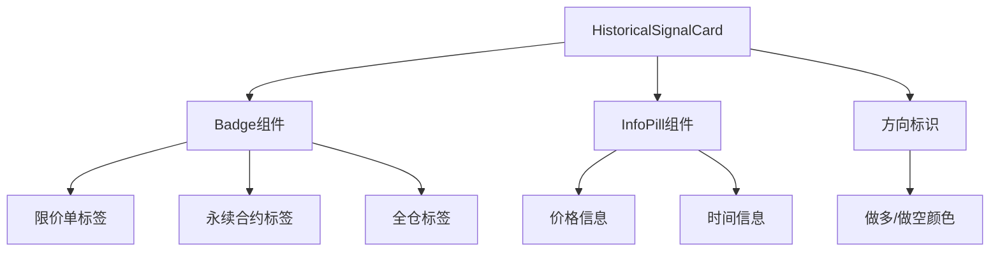
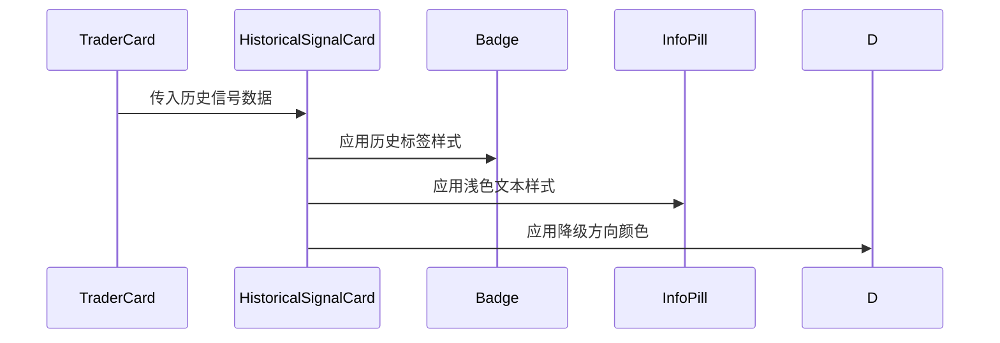

# 历史信号标签浅色处理设计文档

## 概述

本设计文档旨在优化历史信号的视觉表现，通过对标签（限价单、永续合约、全仓）使用浅色处理，强化历史信号已过期的视觉感受，提升用户对信号状态的识别体验。

## 技术架构

### 1. 组件架构



### 2. 数据流



## 视觉设计规范

### 1. 历史信号标签浅色处理

#### 当前状态（需要优化）
- 限价单、永续合约、全仓标签使用标准的 `variant="secondary"` 样式
- 与当前信号的标签样式完全相同，缺乏视觉区分

#### 目标状态
- 历史信号的标签使用浅色背景和文本
- 保持标签的可读性，同时明确传达"已过期"的状态
- 参考挂单列表的历史挂单处理方式

### 2. 颜色规范

| 标签类型 | 当前信号样式 | 历史信号样式 |
|---------|-------------|-------------|
| 限价单/永续合约/全仓 | `variant="secondary"` | `variant="outline"` + 浅色文本 |
| 背景色 | 标准secondary背景 | `bg-muted/30` |
| 文本色 | 标准文本色 | `text-muted-foreground` |
| 边框色 | 默认边框 | `border-muted` |

### 3. 参考实现

参考我的账户页面中挂单列表的历史处理：

```typescript
// 参考 my-account/page.tsx 的处理方式
<Badge className={cn(
  'px-2 py-0 text-xs', 
  isHistorical 
    ? 'bg-muted text-muted-foreground' 
    : 'bg-green-500/20 text-green-400'
)}>
  {order.direction}
</Badge>
```

## 实现方案

### 1. Badge组件样式扩展

#### 方案A：直接修改HistoricalSignalCard组件
在 `HistoricalSignalCard` 组件中对Badge组件应用条件样式：

```typescript
function HistoricalSignalCard({ signal }: { signal: HistoricalSignal }) {
  // 历史信号标签样式
  const historicalBadgeClasses = "bg-muted/30 text-muted-foreground border-muted hover:bg-muted/40";
  
  return (
    <Card className="bg-card/80 border-border/50">
      <CardContent className="p-4">
        {/* ... 其他内容 ... */}
        <div className="flex items-center gap-2">
          <Badge variant="outline" className={historicalBadgeClasses}>
            {signal.orderType}
          </Badge>
          <Badge variant="outline" className={historicalBadgeClasses}>
            {signal.contractType}
          </Badge>
          <Badge variant="outline" className={historicalBadgeClasses}>
            {signal.marginMode}
          </Badge>
        </div>
        {/* ... 其他内容 ... */}
      </CardContent>
    </Card>
  );
}
```

#### 方案B：创建专用的HistoricalBadge组件（推荐）

```typescript
// 新增组件：HistoricalBadge.tsx
interface HistoricalBadgeProps {
  children: React.ReactNode;
  className?: string;
}

function HistoricalBadge({ children, className }: HistoricalBadgeProps) {
  return (
    <Badge 
      variant="outline" 
      className={cn(
        "bg-muted/30 text-muted-foreground border-muted",
        "hover:bg-muted/40 transition-colors",
        "px-2 py-0.5 text-xs",
        className
      )}
    >
      {children}
    </Badge>
  );
}
```

### 2. 组件集成

#### 在HistoricalSignalCard中使用：

```typescript
function HistoricalSignalCard({ signal }: { signal: HistoricalSignal }) {
  return (
    <Card className="bg-card/80 border-border/50">
      <CardContent className="p-4">
        <div className="flex justify-between items-start mb-3">
          <div className="flex flex-col gap-2 items-start">
            <div className="font-mono text-base text-muted-foreground">
              {signal.pair}
            </div>
            <div className="flex items-center gap-2">
              <HistoricalBadge>{signal.orderType}</HistoricalBadge>
              <HistoricalBadge>{signal.contractType}</HistoricalBadge>
              <HistoricalBadge>{signal.marginMode}</HistoricalBadge>
            </div>
          </div>
          {/* ... 其他内容 ... */}
        </div>
        {/* ... 其他内容 ... */}
      </CardContent>
    </Card>
  );
}
```

## 用户体验优化

### 1. 视觉层次

- **当前信号**: 使用标准的 `variant="secondary"` 保持突出显示
- **历史信号**: 使用浅色处理，减弱视觉权重
- **过渡动画**: 添加 `transition-colors` 实现平滑的颜色过渡

### 2. 可访问性

- 确保浅色文本仍具备足够的对比度，符合WCAG可访问性标准
- 保持标签的可读性，不影响用户对信息的获取
- 通过颜色和透明度的组合，而非仅依赖颜色来传达状态差异

### 3. 一致性

- 与挂单列表中历史挂单的处理方式保持一致
- 与现有的历史信号其他元素（文本、价格信息）的浅色处理保持统一
- 遵循项目现有的设计系统和颜色规范

## 技术实现

### 1. 文件修改列表

```
src/
├── app/trader/[id]/page.tsx          # 修改HistoricalSignalCard组件
└── components/
    └── HistoricalBadge.tsx           # 新增专用Badge组件（可选）
```

### 2. 实现步骤

1. **分析现有实现**: 确认当前HistoricalSignalCard的Badge使用方式
2. **样式设计**: 基于挂单列表的实现，设计历史信号标签的浅色样式
3. **组件实现**: 选择方案A或方案B进行实现
4. **集成测试**: 确保新样式在不同屏幕尺寸下的表现
5. **视觉验证**: 确认与设计要求的一致性

### 3. 样式配置

```css
/* Tailwind类名组合 */
.historical-badge {
  @apply bg-muted/30 text-muted-foreground border-muted;
  @apply hover:bg-muted/40 transition-colors;
  @apply px-2 py-0.5 text-xs;
}
```

## 测试验证

### 1. 视觉测试

- [ ] 历史信号标签显示为浅色
- [ ] 与当前信号标签有明显视觉区分
- [ ] 保持良好的可读性
- [ ] 响应式设计在各种屏幕尺寸下正常工作

### 2. 用户体验测试

- [ ] 用户能够快速识别历史信号状态
- [ ] 浅色处理强化了"已过期"的感觉
- [ ] 不影响重要信息的获取

### 3. 兼容性测试

- [ ] 与现有组件系统兼容
- [ ] 不破坏其他页面的Badge显示
- [ ] 符合项目的设计规范

## 扩展性考虑

### 1. 未来优化

- 可以考虑添加更多的历史状态标识（如过期时间、状态图标等）
- 支持主题切换时的样式适配
- 可以扩展到其他需要历史状态区分的组件

### 2. 维护性

- 通过专用组件（HistoricalBadge）提高代码复用性
- 样式集中管理，便于未来调整
- 遵循现有的组件设计模式，降低维护成本