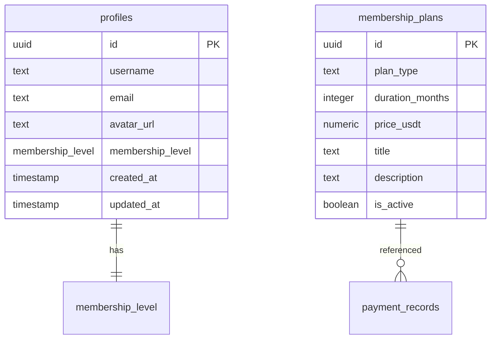
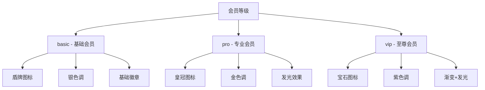
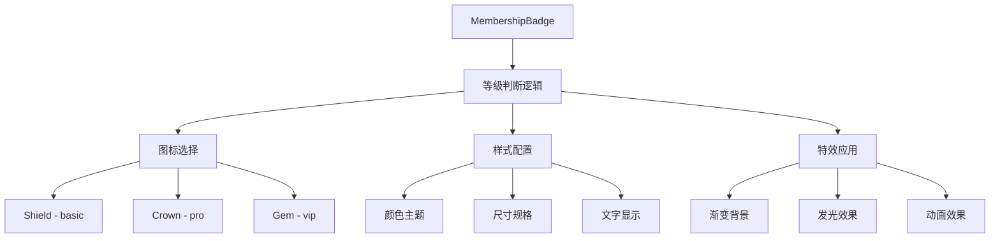

# 会员标识差异化功能设计

## 1. 概述

当前项目中所有会员用户的标识图标都使用相同的皇冠图标（Crown）和黄色样式，缺乏等级区分和视觉差异化。本设计旨在为不同会员等级提供独特的图标样式，增强用户体验和会员等级的识别度。

## 2. 现状分析

### 2.1 当前实现
- 所有会员显示相同的皇冠图标
- 统一的黄色背景样式：`bg-yellow-400 text-yellow-900`
- 仅通过文本内容区分会员类型
- 显示位置：用户名右侧的徽章

### 2.2 存在问题
- 缺乏视觉层次感
- 无法快速区分会员等级
- 降低高级会员的专属感
- 影响产品的会员体系价值展示

## 3. 技术架构

### 3.1 数据模型

当前会员数据结构基于以下表：



### 3.2 会员等级枚举
```sql
CREATE TYPE public.membership_level AS ENUM ('free','basic','pro','vip');
```

## 4. 设计方案

### 4.1 会员图标设计系统

#### 4.1.1 图标映射规则

| 会员等级 | 图标组件 | 主色调 | 背景色 | 文字色 | 特殊效果 |
|---------|---------|--------|--------|--------|----------|
| free | 无图标 | - | - | - | - |
| basic | Shield | 银色 | bg-slate-400 | text-slate-900 | 无 |
| pro | Crown | 金色 | bg-yellow-400 | text-yellow-900 | 无 |
| vip | Gem | 紫色 | bg-purple-500 | text-purple-100 | 渐变效果 |

#### 4.1.2 视觉层次设计



### 4.2 组件架构设计

#### 4.2.1 会员徽章组件

创建可复用的会员徽章组件，支持不同等级的样式渲染：

```typescript
interface MembershipBadgeProps {
  level: 'free' | 'basic' | 'pro' | 'vip';
  membershipType?: string;
  size?: 'sm' | 'md' | 'lg';
  showText?: boolean;
}
```

#### 4.2.2 图标配置系统

```typescript
interface MembershipConfig {
  icon: React.ComponentType;
  colors: {
    background: string;
    text: string;
    border?: string;
  };
  effects?: {
    gradient?: boolean;
    glow?: boolean;
    animation?: boolean;
  };
}
```

## 5. 实现策略

### 5.1 组件重构

#### 5.1.1 MembershipBadge组件

创建统一的会员徽章组件替代现有的内联实现：



#### 5.1.2 使用位置改造

需要替换的页面和组件：
- `/src/app/profile/page.tsx` - 个人中心用户名显示
- `/src/app/page.tsx` - 交易员榜单徽章显示
- 其他可能显示会员身份的位置

### 5.2 样式系统

#### 5.2.1 Tailwind CSS 配置扩展

在 `tailwind.config.ts` 中添加会员主题色彩：

```typescript
extend: {
  colors: {
    membership: {
      basic: {
        50: '#f8fafc',
        400: '#94a3b8',
        900: '#0f172a'
      },
      pro: {
        50: '#fffbeb', 
        400: '#fbbf24',
        900: '#92400e'
      },
      vip: {
        50: '#faf5ff',
        500: '#a855f7',
        100: '#e9d5ff'
      }
    }
  }
}
```

#### 5.2.2 特效样式类

```css
.membership-glow-vip {
  box-shadow: 0 0 8px rgba(168, 85, 247, 0.5);
}

.membership-gradient-vip {
  background: linear-gradient(135deg, #a855f7, #c084fc);
}
```

## 6. 交互体验

### 6.1 响应式适配

| 屏幕尺寸 | 徽章尺寸 | 图标大小 | 文字显示 |
|---------|----------|----------|----------|
| Mobile (< 768px) | 小号 | 12px | 简化显示 |
| Tablet (768px-1024px) | 中号 | 14px | 完整显示 |  
| Desktop (> 1024px) | 大号 | 16px | 完整显示 |

### 6.2 动效设计

- **basic会员**: 静态显示，无特效
- **pro会员**: 轻微的悬停高亮效果
- **vip会员**: 柔和的脉冲动画，增强视觉吸引力

## 7. 兼容性考虑

### 7.1 向后兼容

- 保持现有 `membership` 字段的数据结构
- 新组件向后兼容旧的字符串类型显示
- 渐进式升级，避免破坏性变更

### 7.2 降级策略

- 当图标加载失败时，回退到文字显示
- 不支持特效的环境下，使用基础样式
- 保证在所有设备上的基本功能正常

## 8. 测试策略

### 8.1 组件测试

- 不同会员等级的正确渲染
- 响应式布局在各尺寸下的表现
- 特效动画的性能影响

### 8.2 集成测试

- 在个人中心页面的显示效果
- 在交易员榜单的显示效果
- 数据更新后的实时刷新

### 8.3 用户体验测试

- 不同等级徽章的识别度
- 色彩对比度的可访问性
- 移动端触摸交互体验    }
  }
}
```

#### 5.2.2 特效样式类

```css
.membership-glow-vip {
  box-shadow: 0 0 8px rgba(168, 85, 247, 0.5);
}

.membership-gradient-vip {
  background: linear-gradient(135deg, #a855f7, #c084fc);
}
```

## 6. 交互体验

### 6.1 响应式适配

| 屏幕尺寸 | 徽章尺寸 | 图标大小 | 文字显示 |
|---------|----------|----------|----------|
| Mobile (< 768px) | 小号 | 12px | 简化显示 |
| Tablet (768px-1024px) | 中号 | 14px | 完整显示 |  
| Desktop (> 1024px) | 大号 | 16px | 完整显示 |

### 6.2 动效设计

- **basic会员**: 静态显示，无特效
- **pro会员**: 轻微的悬停高亮效果
- **vip会员**: 柔和的脉冲动画，增强视觉吸引力

## 7. 兼容性考虑

### 7.1 向后兼容

- 保持现有 `membership` 字段的数据结构
- 新组件向后兼容旧的字符串类型显示
- 渐进式升级，避免破坏性变更

### 7.2 降级策略

- 当图标加载失败时，回退到文字显示
- 不支持特效的环境下，使用基础样式
- 保证在所有设备上的基本功能正常

## 8. 测试策略

### 8.1 组件测试

- 不同会员等级的正确渲染
- 响应式布局在各尺寸下的表现
- 特效动画的性能影响

### 8.2 集成测试

- 在个人中心页面的显示效果
- 在交易员榜单的显示效果
- 数据更新后的实时刷新

### 8.3 用户体验测试

- 不同等级徽章的识别度
- 色彩对比度的可访问性
- 移动端触摸交互体验


