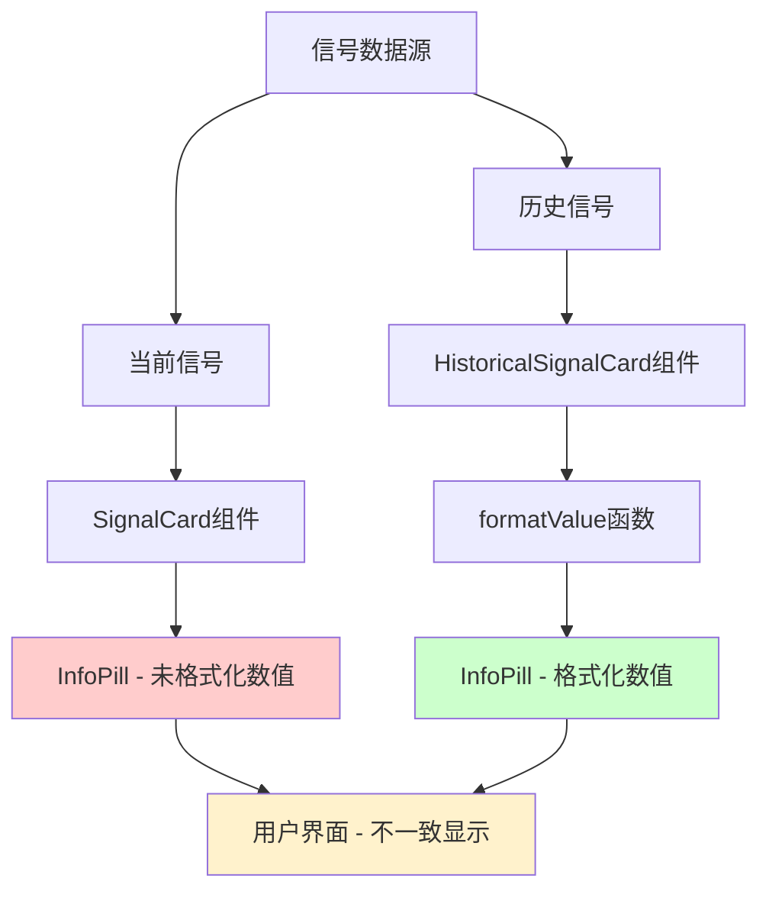
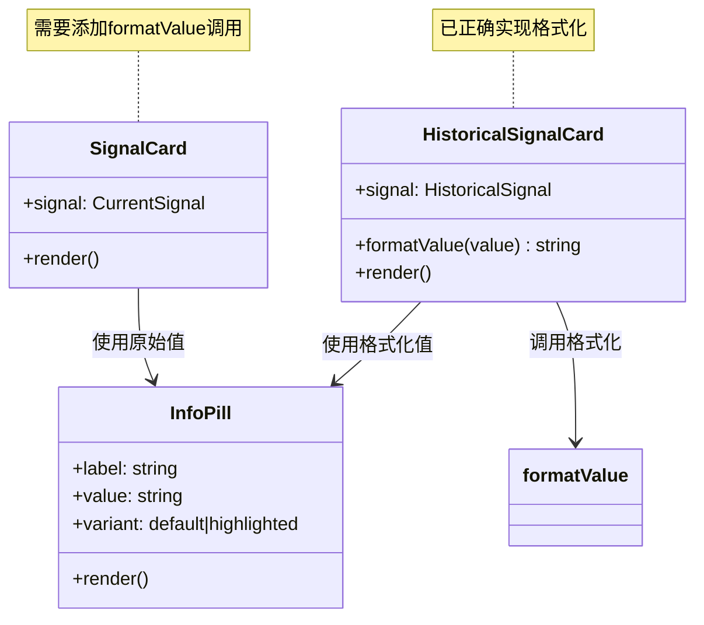

# 信号数值显示一致性调整

## 概述

当前信号列表中的当前信号（Current Signal）与历史信号（Historical Signal）在数字指标的小数点展示逻辑不一致。历史信号已经应用了统一的两位小数格式化，但当前信号仍然使用原始数据显示，导致用户体验不一致。

## 问题分析

### 当前状态
- **历史信号**: 使用 `formatValue()` 函数统一格式化，所有数值保留两位小数
- **当前信号**: 直接显示原始值，数值格式不统一

### 影响范围
当前信号卡片中的以下字段存在格式不一致问题：
- 入场点位 (`entryPrice`)
- 止盈点位 1 (`takeProfit1`) 
- 止盈点位 2 (`takeProfit2`)
- 止损点位 (`stopLoss`)

## 技术架构

### 数据流图



### 组件关系图



## 解决方案

### 1. 统一数值格式化逻辑

将历史信号中已实现的 `formatValue` 函数应用到当前信号卡片中：

```typescript
// 现有的格式化函数（在HistoricalSignalCard中）
const formatValue = (value: string | null): string => {
  if (!value || value === '--') return '--';
  const numValue = parseFloat(value.toString());
  if (isNaN(numValue)) return value.toString();
  return numValue.toFixed(2); // 保留两位小数，四舍五入
};
```

### 2. 修改当前信号显示逻辑

在 `SignalCard` 组件中应用统一的数值格式化：

| 字段 | 当前显示 | 修改后显示 |
|------|----------|------------|
| 入场点位 | `{signal.entryPrice}` | `{formatValue(signal.entryPrice)}` |
| 止盈点位 1 | `{signal.takeProfit1}` | `{formatValue(signal.takeProfit1)}` |
| 止盈点位 2 | `{signal.takeProfit2}` | `{formatValue(signal.takeProfit2)}` |
| 止损点位 | `{signal.stopLoss}` | `{formatValue(signal.stopLoss)}` |

### 3. 价格区间处理

对于包含价格区间的入场点位（如 "68234.50-68456.78"），需要特殊处理：

```typescript
const formatPriceRange = (value: string | null): string => {
  if (!value || value === '--') return '--';
  
  // 检查是否为价格区间
  if (value.includes('-')) {
    const [start, end] = value.split('-');
    const startFormatted = formatValue(start);
    const endFormatted = formatValue(end);
    return `${startFormatted}-${endFormatted}`;
  }
  
  return formatValue(value);
};
```

## 实现细节

### 代码修改位置

文件: `/src/app/trader/[id]/page.tsx`

#### 修改前 (SignalCard组件)
```typescript
<InfoPill label="入场点位" value={signal.entryPrice} variant="highlighted" />
<InfoPill label="止盈点位 1" value={signal.takeProfit1} variant="highlighted" />
<InfoPill label="止盈点位 2" value={signal.takeProfit2} variant="highlighted" />
<InfoPill label="止损点位" value={signal.stopLoss} variant="highlighted" />
```

#### 修改后 (SignalCard组件)
```typescript
<InfoPill label="入场点位" value={formatPriceRange(signal.entryPrice)} variant="highlighted" />
<InfoPill label="止盈点位 1" value={formatValue(signal.takeProfit1)} variant="highlighted" />
<InfoPill label="止盈点位 2" value={formatValue(signal.takeProfit2)} variant="highlighted" />
<InfoPill label="止损点位" value={formatValue(signal.stopLoss)} variant="highlighted" />
```

### 函数定义位置

将格式化函数提取到 SignalCard 组件内部，与 HistoricalSignalCard 保持相同的实现逻辑。

## 测试策略

### 单元测试覆盖

| 测试场景 | 输入值 | 期望输出 |
|----------|--------|----------|
| 整数价格 | "68000" | "68000.00" |
| 小数价格 | "68234.5" | "68234.50" |
| 高精度价格 | "68234.56789" | "68234.57" |
| 价格区间 | "68000-68500" | "68000.00-68500.00" |
| 空值处理 | null | "--" |
| 无效值 | "invalid" | "invalid" |

### 视觉验证清单

- [ ] 当前信号所有数值显示两位小数
- [ ] 历史信号数值格式保持不变
- [ ] 价格区间正确格式化
- [ ] 空值显示为"--"
- [ ] 数值对齐保持一致

## 兼容性考虑

### 数据源兼容性
- 兼容现有数据库字段类型 (text)
- 支持模拟数据生成逻辑
- 保持与统计计算逻辑一致

### UI组件兼容性
- 不影响 InfoPill 组件接口
- 保持现有样式变体 (highlighted)
- 维持响应式布局

## 性能影响

### 计算开销
- `formatValue` 函数计算复杂度: O(1)
- 每个信号卡片增加 4 次格式化调用
- 对页面渲染性能影响可忽略

### 内存使用
- 格式化结果为临时字符串，GC自动回收
- 无额外持久化存储需求

## 数据一致性规范

### 小数点格式规范
- **固定位数**: 所有价格数值统一保留两位小数
- **舍入规则**: 使用四舍五入 (`toFixed(2)`)
- **显示格式**: 123.45, 不使用千分位分隔符

### 特殊值处理
- **空值**: 显示为 "--"
- **无效值**: 保持原样显示，不强制转换
- **价格区间**: 两端数值分别格式化

### 与现有规范的一致性
根据项目规范要求：
> 前端显示的数值（如点位、价格）应保留两位小数，使用四舍五入处理，无效值保持原样显示

此修改完全符合现有的数值显示格式规范，确保整个应用的数据展示一致性。