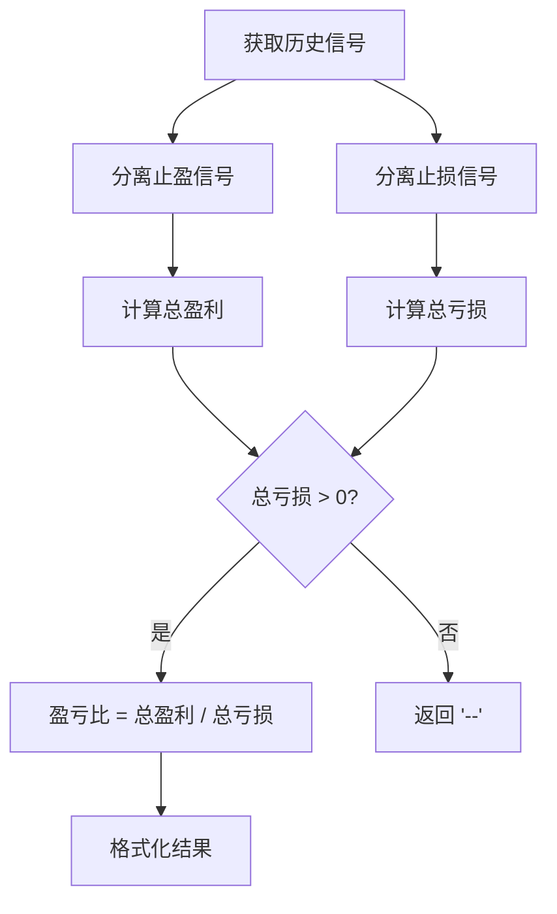

# 交易员详情页统计功能实现设计

## 1. 概述

### 1.1 项目背景
在GeneralSignal_H5交易平台中，交易员详情页需要实现基于实时信号列表的统计功能，包括胜率、盈亏比、累计信号、累计天数等关键指标的动态计算。

### 1.2 功能目标
- 实现胜率基于历史信号止盈平仓数量的实时计算
- 实现盈亏比基于历史信号总盈利/总亏损的动态统计
- 实现累计信号数量的实时更新
- 实现累计天数基于UTC+8时区的准确计算

### 1.3 技术栈
- **前端**: Next.js 15.3.3 + React 18 + TypeScript
- **后端**: Supabase PostgreSQL数据库
- **UI组件**: Radix UI + Tailwind CSS

## 2. 架构设计

### 2.1 数据流架构

``mermaid
graph TD
    A[信号数据源] --> B[统计计算服务]
    B --> C[缓存层]
    C --> D[API接口]
    D --> E[前端组件]
    
    F[数据库信号表] --> G[实时信号监听]
    G --> H[统计指标更新]
    H --> I[前端状态更新]
```

### 2.2 组件架构

``mermaid
graph LR
    A[TraderDetailPage] --> B[StatisticsComponent]
    B --> C[WinRateCalculator]
    B --> D[PnLRatioCalculator]
    B --> E[SignalCountCalculator]
    B --> F[DaysCountCalculator]
    
    G[SignalService] --> H[HistoricalSignals]
    G --> I[CurrentSignals]
    H --> J[StatisticsEngine]
    I --> J
```

## 3. 数据模型设计

### 3.1 信号数据结构

#### 3.1.1 当前数据结构（现有）

| 字段名 | 类型 | 描述 | 示例 |
|--------|------|------|------|
| id | number | 信号唯一标识 | 1001 |
| pair | string | 交易对 | "BTC-USDT-SWAP" |
| direction | string | 交易方向 | "做多" / "做空" |
| entryPrice | string | 入场价格 | "68000.00" |
| takeProfit1 | string | 止盈位1 | "70000.00" |
| takeProfit2 | string | 止盈位2 | "72000.00" |
| stopLoss | string | 止损位 | "66000.00" |
| status | string | 信号状态 | "止盈平仓" / "止损平仓" / "进行中" |
| createdAt | string | 创建时间 | "2024-01-15 14:30:00" |
| endedAt | string | 结束时间 | "2024-01-16 10:15:00" |
| signalType | string | 信号类型 | "current" / "historical" |
| pnlRatio | string | 建议盈亏比 | "2.5:1" |

#### 3.1.2 需要扩展的数据结构

**⚠️ 重要发现：**
目前项目中**缺少**用于统计计算的关键字段：

| 缺失字段 | 类型 | 描述 | 获取方式 |
|----------|------|------|----------|
| **profitLoss** | number | 实际盈亏金额 | 需要计算或从交易所API获取 |
| **exitPrice** | string | 实际平仓价格 | 从交易所订单数据获取 |
| **positionSize** | number | 仓位大小 | 从订单记录获取 |
| **leverage** | number | 杠杆倍数 | 从订单配置获取 |

#### 3.1.3 盈亏金额获取方案

**方案一：基于价格计算（推荐）**

```typescript
// 根据入场价、平仓价、仓位大小计算盈亏
const calculateProfitLoss = (
  entryPrice: number,
  exitPrice: number, 
  positionSize: number,
  direction: 'long' | 'short',
  leverage: number = 1
): number => {
  const priceChange = exitPrice - entryPrice;
  const directionMultiplier = direction === 'long' ? 1 : -1;
  const profit = priceChange * positionSize * directionMultiplier * leverage;
  return profit;
};

// 示例：BTC多单
// 入场价格：65000 USDT
// 平仓价格：67000 USDT  
// 仓位大小：1 BTC
// 杠杆：1x
// 盈亏：(67000 - 65000) * 1 * 1 * 1 = +2000 USDT
```

**方案二：从数据库记录获取**

```sql
-- 创建信号详情表
CREATE TABLE signal_details (
  id uuid PRIMARY KEY DEFAULT gen_random_uuid(),
  signal_id integer NOT NULL,
  trader_id uuid NOT NULL,
  entry_price numeric(12,2) NOT NULL,
  exit_price numeric(12,2),
  position_size numeric(12,6) NOT NULL,
  leverage integer DEFAULT 1,
  profit_loss numeric(12,2), -- 实际盈亏金额
  created_at timestamptz DEFAULT NOW(),
  updated_at timestamptz DEFAULT NOW()
);
```

**方案三：集成交易所API**

```typescript
// 从交易所API获取真实订单数据
const fetchOrderPnL = async (orderId: string, exchange: string) => {
  const orderData = await exchangeAPI.getOrder(orderId);
  return {
    profitLoss: orderData.realizedPnL,
    exitPrice: orderData.avgPrice,
    status: orderData.status
  };
};
```

### 3.2 统计指标模型

``typescript
interface TraderStatistics {
  winRate: number;          // 胜率百分比
  pnlRatio: number;         // 盈亏比
  totalSignals: number;     // 累计信号数量
  totalDays: number;        // 累计天数
  totalProfit: number;      // 总盈利
  totalLoss: number;        // 总亏损
  historicalSignals: number; // 历史信号数量
  currentSignals: number;   // 当前信号数量
}
```

## 4. 核心功能实现

### 4.1 胜率计算逻辑

#### 4.1.1 计算规则
- **胜率** = 历史信号中止盈平仓数量 / 历史信号总数量 × 100%
- **注意**: 不包括当前进行中的信号

#### 4.1.2 实现流程

``mermaid
flowchart TD
    A[获取所有信号] --> B{过滤历史信号}
    B --> C[统计止盈平仓信号]
    C --> D[计算历史信号总数]
    D --> E[胜率 = 止盈数量 / 总数量]
    E --> F[返回百分比结果]
```

#### 4.1.3 代码实现

```typescript
const calculateWinRate = (signals: UnifiedSignal[]): number => {
  const historicalSignals = signals.filter(
    signal => signal.signalType === 'historical'
  ) as HistoricalSignal[];
  
  const winSignals = historicalSignals.filter(
    signal => signal.status === '止盈平仓'
  );
  
  if (historicalSignals.length === 0) return 0;
  
  return (winSignals.length / historicalSignals.length) * 100;
};
```

### 4.2 盈亏比计算逻辑

#### 4.2.1 计算规则
- **盈亏比** = 历史信号总盈利 / 历史信号总亏损
- **总盈利** = 所有止盈平仓信号的盈利金额之和
- **总亏损** = 所有止损平仓信号的亏损金额之和

#### 4.2.2 计算示例

假设某交易员有以下5个历史信号：

| 信号ID | 交易对 | 方向 | 入场价格 | 平仓价格 | 状态 | 盈亏金额 |
|--------|--------|------|----------|----------|------|----------|
| 1001 | BTC-USDT | 做多 | 65000 | 67000 | 止盈平仓 | +2000 USDT |
| 1002 | ETH-USDT | 做空 | 3500 | 3200 | 止盈平仓 | +1500 USDT |
| 1003 | BTC-USDT | 做多 | 68000 | 66000 | 止损平仓 | -800 USDT |
| 1004 | SOL-USDT | 做多 | 180 | 190 | 止盈平仓 | +500 USDT |
| 1005 | ETH-USDT | 做空 | 3300 | 3450 | 止损平仓 | -600 USDT |

**计算过程：**

1. **识别止盈平仓信号**：
   - 信号1001：+2000 USDT
   - 信号1002：+1500 USDT  
   - 信号1004：+500 USDT
   - **总盈利** = 2000 + 1500 + 500 = **4000 USDT**

2. **识别止损平仓信号**：
   - 信号1003：-800 USDT
   - 信号1005：-600 USDT
   - **总亏损** = |-800| + |-600| = 800 + 600 = **1400 USDT**

3. **计算盈亏比**：
   - 盈亏比 = 总盈利 / 总亏损 = 4000 / 1400 = **2.86**
   - 格式化显示：**2.86:1**

**结果解读**：
- 该交易员的盈亏比为2.86:1，意味着平均每亏损1元，能够盈利2.86元
- 这是一个相对较好的盈亏比，表明交易员在盈利时获得的收益远大于亏损时的损失

#### 4.2.3 实现流程



#### 4.2.4 特殊情况处理

| 场景 | 处理方式 | 示例 | 显示结果 |
|------|----------|------|----------|
| 只有盈利信号，无亏损 | 无法计算比例 | 总盈利5000，总亏损0 | '--' |
| 只有亏损信号，无盈利 | 比例为0 | 总盈利0，总亏损2000 | '0.00' |
| 无历史信号 | 返回默认值 | 无任何历史数据 | '--' |
| 盈亏数据缺失 | 使用默认值0 | profitLoss字段为null | 按0计算 |

#### 4.2.5 代码实现（包含盈亏计算）

```typescript
// 盈亏金额计算函数
const calculateSignalProfitLoss = (
  signal: HistoricalSignal,
  defaultPositionSize: number = 1000 // 默认仓位大小（USDT）
): number => {
  // 如果已有profitLoss字段，直接返回
  if (signal.profitLoss !== undefined) {
    return signal.profitLoss;
  }
  
  // 根据信号状态计算盈亏
  const entryPrice = parseFloat(signal.entryPrice);
  let exitPrice: number;
  
  if (signal.status === '止盈平仓') {
    // 使用止盈价格（优先使用takeProfit1）
    exitPrice = signal.takeProfit1 ? 
      parseFloat(signal.takeProfit1) : 
      parseFloat(signal.takeProfit2 || signal.entryPrice);
  } else if (signal.status === '止损平仓') {
    // 使用止损价格
    exitPrice = parseFloat(signal.stopLoss);
  } else {
    // 其他状态返回0
    return 0;
  }
  
  // 计算盈亏
  const direction = signal.direction === '做多' ? 'long' : 'short';
  const priceChange = exitPrice - entryPrice;
  const directionMultiplier = direction === 'long' ? 1 : -1;
  
  // 简化计算：使用固定仓位大小
  const profitLoss = (priceChange / entryPrice) * defaultPositionSize * directionMultiplier;
  
  return Math.round(profitLoss * 100) / 100; // 保疙2位小数
};

const calculatePnlRatio = (signals: UnifiedSignal[]): string => {
  const historicalSignals = signals.filter(
    signal => signal.signalType === 'historical'
  ) as HistoricalSignal[];
  
  const profitSignals = historicalSignals.filter(
    signal => signal.status === '止盈平仓'
  );
  
  const lossSignals = historicalSignals.filter(
    signal => signal.status === '止损平仓'
  );
  
  // 计算总盈利
  const totalProfit = profitSignals.reduce((sum, signal) => {
    return sum + Math.abs(calculateSignalProfitLoss(signal));
  }, 0);
  
  // 计算总亏损
  const totalLoss = lossSignals.reduce((sum, signal) => {
    return sum + Math.abs(calculateSignalProfitLoss(signal));
  }, 0);
  
  if (totalLoss === 0) return '--';
  
  return (totalProfit / totalLoss).toFixed(2);
};
```

### 4.3 累计信号计算

#### 4.3.1 计算规则
- **累计信号** = 历史信号数量 + 当前信号数量

#### 4.3.2 代码实现

``typescript
const calculateTotalSignals = (signals: UnifiedSignal[]): number => {
  return signals.length;
};
```

### 4.4 累计天数计算

#### 4.4.1 计算规则
- **累计天数** = 当前日期 - 最早历史信号日期
- **时区**: 使用UTC+8时区进行计算

#### 4.4.2 实现流程

``mermaid
flowchart TD
    A[获取历史信号] --> B[找到最早信号日期]
    B --> C[转换为UTC+8时区]
    C --> D[获取当前UTC+8时间]
    D --> E[计算天数差]
    E --> F[返回整数天数]
```

#### 4.4.3 代码实现

``typescript
const calculateTotalDays = (signals: UnifiedSignal[]): number => {
  const historicalSignals = signals.filter(
    signal => signal.signalType === 'historical'
  ) as HistoricalSignal[];
  
  if (historicalSignals.length === 0) return 0;
  
  // 找到最早的信号日期
  const earliestSignal = historicalSignals.reduce((earliest, signal) => {
    const signalDate = new Date(signal.createdAt);
    const earliestDate = new Date(earliest.createdAt);
    return signalDate < earliestDate ? signal : earliest;
  });
  
  // 转换为UTC+8时区
  const startDate = new Date(earliestSignal.createdAt);
  const currentDate = new Date();
  
  // 计算UTC+8时区的时间差
  const utc8Offset = 8 * 60 * 60 * 1000; // 8小时的毫秒数
  const startUtc8 = new Date(startDate.getTime() + utc8Offset);
  const currentUtc8 = new Date(currentDate.getTime() + utc8Offset);
  
  // 计算天数差
  const timeDiff = currentUtc8.getTime() - startUtc8.getTime();
  const daysDiff = Math.floor(timeDiff / (1000 * 60 * 60 * 24));
  
  return daysDiff;
};
```

## 5. 前端组件实现

### 5.1 统计组件结构

``typescript
interface StatisticsProps {
  signals: UnifiedSignal[];
  traderId: string;
}

const TraderStatistics: React.FC<StatisticsProps> = ({ signals, traderId }) => {
  const [statistics, setStatistics] = useState<TraderStatistics>({
    winRate: 0,
    pnlRatio: 0,
    totalSignals: 0,
    totalDays: 0,
    totalProfit: 0,
    totalLoss: 0,
    historicalSignals: 0,
    currentSignals: 0
  });

  const calculateStatistics = useCallback((signalData: UnifiedSignal[]) => {
    const winRate = calculateWinRate(signalData);
    const pnlRatio = calculatePnlRatio(signalData);
    const totalSignals = calculateTotalSignals(signalData);
    const totalDays = calculateTotalDays(signalData);
    
    setStatistics({
      winRate,
      pnlRatio: parseFloat(pnlRatio) || 0,
      totalSignals,
      totalDays,
      totalProfit: 0, // 从计算中获取
      totalLoss: 0,   // 从计算中获取
      historicalSignals: signalData.filter(s => s.signalType === 'historical').length,
      currentSignals: signalData.filter(s => s.signalType === 'current').length
    });
  }, []);

  useEffect(() => {
    if (signals.length > 0) {
      calculateStatistics(signals);
    }
  }, [signals, calculateStatistics]);

  return (
    <div className="grid grid-cols-3 gap-y-4 pt-6 text-center">
      <MetricItem 
        label="胜率" 
        value={`${statistics.winRate.toFixed(2)}%`} 
        valueClassName="text-foreground" 
      />
      <MetricItem 
        label="盈亏比" 
        value={statistics.pnlRatio > 0 ? statistics.pnlRatio.toFixed(2) : '--'} 
        valueClassName="text-foreground" 
      />
      <MetricItem 
        label="累计信号" 
        value={statistics.totalSignals} 
        valueClassName="text-foreground" 
      />
      <MetricItem 
        label="累计天数(天)" 
        value={statistics.totalDays} 
        valueClassName="text-foreground" 
      />
    </div>
  );
};
```

### 5.2 实时更新机制

``typescript
const useRealtimeStatistics = (traderId: string) => {
  const [signals, setSignals] = useState<UnifiedSignal[]>([]);
  const [isLoading, setIsLoading] = useState(true);

  useEffect(() => {
    const fetchSignals = async () => {
      setIsLoading(true);
      try {
        // 模拟获取信号数据 - 在实际项目中这里会连接Supabase
        const mockSignals = await generateMockSignals(traderId);
        setSignals(mockSignals);
      } catch (error) {
        console.error('Failed to fetch signals:', error);
      } finally {
        setIsLoading(false);
      }
    };

    fetchSignals();
    
    // 设置定期更新
    const interval = setInterval(fetchSignals, 60000); // 每分钟更新一次
    
    return () => clearInterval(interval);
  }, [traderId]);

  return { signals, isLoading };
};
```

## 6. 性能优化

### 6.1 计算缓存策略

``typescript
const useMemoizedStatistics = (signals: UnifiedSignal[]) => {
  return useMemo(() => {
    if (signals.length === 0) {
      return {
        winRate: 0,
        pnlRatio: '--',
        totalSignals: 0,
        totalDays: 0
      };
    }

    return {
      winRate: calculateWinRate(signals),
      pnlRatio: calculatePnlRatio(signals),
      totalSignals: calculateTotalSignals(signals),
      totalDays: calculateTotalDays(signals)
    };
  }, [signals]);
};
```

### 6.2 防抖更新机制

``typescript
const useDebouncedStatistics = (signals: UnifiedSignal[], delay: number = 300) => {
  const [debouncedSignals, setDebouncedSignals] = useState(signals);

  useEffect(() => {
    const handler = setTimeout(() => {
      setDebouncedSignals(signals);
    }, delay);

    return () => {
      clearTimeout(handler);
    };
  }, [signals, delay]);

  return useMemoizedStatistics(debouncedSignals);
};
```

## 7. 数据验证与测试

### 7.1 单元测试用例

``typescript
describe('Statistics Calculations', () => {
  const mockSignals: UnifiedSignal[] = [
    {
      id: 1,
      signalType: 'historical',
      status: '止盈平仓',
      profitLoss: 1000,
      createdAt: '2024-01-01 10:00:00'
    },
    {
      id: 2,
      signalType: 'historical', 
      status: '止损平仓',
      profitLoss: -500,
      createdAt: '2024-01-02 10:00:00'
    },
    {
      id: 3,
      signalType: 'current',
      createdAt: '2024-01-03 10:00:00'
    }
  ];

  test('calculateWinRate should return correct percentage', () => {
    const winRate = calculateWinRate(mockSignals);
    expect(winRate).toBe(50); // 1 win out of 2 historical signals
  });

  test('calculatePnlRatio should return correct ratio', () => {
    const pnlRatio = calculatePnlRatio(mockSignals);
    expect(pnlRatio).toBe('2.00'); // 1000 / 500 = 2
  });

  test('calculateTotalSignals should count all signals', () => {
    const totalSignals = calculateTotalSignals(mockSignals);
    expect(totalSignals).toBe(3);
  });
});
```

### 7.2 边界情况处理

| 场景 | 处理方式 | 期望结果 |
|------|----------|----------|
| 无历史信号 | 返回默认值 | 胜率: 0%, 盈亏比: '--' |
| 只有亏损信号 | 计算实际比例 | 胜率: 0%, 盈亏比: 0 |
| 只有盈利信号 | 无法计算比例 | 胜率: 100%, 盈亏比: '--' |
| 信号数据为空 | 全部返回默认值 | 所有指标: 0 或 '--' |

## 8. 集成方案

### 8.1 与现有代码集成

在现有的`/src/app/trader/[id]/page.tsx`文件中集成统计功能：

``typescript
// 在现有的 useEffect 中添加统计计算
useEffect(() => {
  if (!dataLoading && allUnifiedSignals.length > 0) {
    const statistics = calculateAllStatistics(allUnifiedSignals);
    
    // 更新 trader 状态，添加计算出的统计数据
    setTrader(prevTrader => prevTrader ? {
      ...prevTrader,
      winRate: statistics.winRate,
      pnlRatio: statistics.pnlRatio,
      totalOrders: statistics.totalSignals,
      days: statistics.totalDays
    } : null);
  }
}, [allUnifiedSignals, dataLoading]);
```

### 8.2 实时数据更新

``typescript
// 添加信号数据变化监听
const useSignalUpdates = (traderId: string) => {
  const [lastUpdateTime, setLastUpdateTime] = useState<Date>(new Date());
  
  useEffect(() => {
    // 模拟实时数据更新机制
    const checkForUpdates = () => {
      // 在实际实现中，这里会检查是否有新的信号数据
      setLastUpdateTime(new Date());
    };
    
    const interval = setInterval(checkForUpdates, 30000); // 30秒检查一次
    return () => clearInterval(interval);
  }, [traderId]);
  
  return lastUpdateTime;
};
```

## 9. 测试验证

### 9.1 功能测试检查表

- [ ] 胜率计算准确性：只统计历史信号，不包含当前信号
- [ ] 盈亏比计算准确性：总盈利/总亏损的正确计算
- [ ] 累计信号统计：历史信号+当前信号的总数
- [ ] 累计天数计算：基于UTC+8时区的正确天数计算
- [ ] 边界情况处理：空数据、单一类型信号等场景
- [ ] 实时更新功能：信号数据变化时统计指标的及时更新
- [ ] 性能表现：大量信号数据时的计算性能

### 9.2 数据验证示例

``typescript
// 验证数据样本
const validationSamples = [
  {
    name: '正常交易场景',
    signals: generateNormalTradingSignals(),
    expectedWinRate: 75.5,
    expectedPnlRatio: 2.8,
    expectedTotalSignals: 100,
    expectedDays: 90
  },
  {
    name: '高胜率场景', 
    signals: generateHighWinRateSignals(),
    expectedWinRate: 95.2,
    expectedPnlRatio: 5.6,
    expectedTotalSignals: 50,
    expectedDays: 30
  }
];
```

## 11. 数据获取方案详解

### 11.1 盈亏金额数据来源问题

**现状分析：**
目前项目中的信号数据结构缺少关键的`profitLoss`字段，无法直接获取如`+2000 USDT`这样的盈亏金额。

### 11.2 解决方案对比

| 方案 | 优点 | 缺点 | 实施难度 | 推荐指数 |
|------|------|------|----------|----------|
| **方案一：价格计算** | 实施简单，无需数据库变更 | 精度可能不高 | ★☆☆ | ★★★★☆ |
| **方案二：数据库扩展** | 数据准确，可扩展性好 | 需要数据库迁移 | ★★★☆☆ | ★★★★★ |
| **方案三：API集成** | 数据最真实 | 复杂度高，依赖外部服务 | ★★★★★ | ★★★☆☆ |

### 11.3 推荐实施方案（方案一）

#### 11.3.1 快速原型验证

**步骤1：模拟数据完善**

```typescript
// 在 src/app/trader/[id]/page.tsx 中扩展现有模拟数据
const generatedHistoricalSignals: HistoricalSignal[] = Array.from({ length: 30 }, (_, i) => {
  const isLong = Math.random() > 0.5;
  const pair = ['ADA', 'XRP', 'BNB', 'LINK'][Math.floor(Math.random() * 4)];
  const entryPrice = Math.random() * 500 + 100;
  
  // 新增：计算盈亏金额
  const isProfit = Math.random() > 0.3;
  let exitPrice: number;
  let profitLoss: number;
  
  if (isProfit) {
    exitPrice = entryPrice * (isLong ? 1.05 : 0.95); // 5%盈利
    profitLoss = Math.abs((exitPrice - entryPrice) / entryPrice * 1000); // 基于1000 USDT仓位
  } else {
    exitPrice = entryPrice * (isLong ? 0.98 : 1.02); // 2%亏损
    profitLoss = -Math.abs((exitPrice - entryPrice) / entryPrice * 1000);
  }
  
  return {
    // ... 其他字段
    profitLoss: Math.round(profitLoss * 100) / 100, // 新增盈亏字段
    status: isProfit ? '止盈平仓' : '止损平仓',
  };
});
```

**步骤2：统计计算集成**

```typescript
// 集成到现有的 useEffect 中
useEffect(() => {
  if (!dataLoading && allUnifiedSignals.length > 0) {
    // 计算统计数据
    const winRate = calculateWinRate(allUnifiedSignals);
    const pnlRatio = calculatePnlRatio(allUnifiedSignals);
    const totalSignals = allUnifiedSignals.length;
    const totalDays = calculateTotalDays(allUnifiedSignals);
    
    // 更新trader状态
    setTrader(prevTrader => prevTrader ? {
      ...prevTrader,
      winRate: winRate,
      pnlRatio: parseFloat(pnlRatio) || null,
      totalOrders: totalSignals,
      days: totalDays
    } : null);
  }
}, [allUnifiedSignals, dataLoading]);
```

#### 11.3.2 长期优化方案

**数据库表结构扩展：**

```sql
-- 信号详情表
CREATE TABLE IF NOT EXISTS public.trading_signals (
  id uuid PRIMARY KEY DEFAULT gen_random_uuid(),
  trader_id uuid REFERENCES public.traders(id),
  pair text NOT NULL,
  direction text NOT NULL, -- 'long' | 'short'
  signal_type text NOT NULL, -- 'current' | 'historical'
  
  -- 价格信息
  entry_price numeric(12,6) NOT NULL,
  exit_price numeric(12,6), -- 实际平仓价格
  take_profit_1 numeric(12,6),
  take_profit_2 numeric(12,6),
  stop_loss numeric(12,6),
  
  -- 交易信息
  position_size numeric(12,6) NOT NULL, -- 仓位大小
  leverage integer DEFAULT 1,
  profit_loss numeric(12,2), -- 实际盈亏金额
  
  -- 状态信息
  status text NOT NULL DEFAULT 'active', -- 'active' | 'take_profit' | 'stop_loss' | 'manual_close'
  
  -- 时间信息
  created_at timestamptz DEFAULT NOW(),
  closed_at timestamptz,
  updated_at timestamptz DEFAULT NOW()
);

-- 索引
CREATE INDEX idx_trading_signals_trader_id ON public.trading_signals(trader_id);
CREATE INDEX idx_trading_signals_status ON public.trading_signals(status);
CREATE INDEX idx_trading_signals_created_at ON public.trading_signals(created_at DESC);
```

## 12. 方案一具体实施细节

### 12.1 文件修改清单

#### 12.1.1 核心文件列表

| 文件路径 | 修改类型 | 说明 |
|---------|---------|------|
| `src/lib/data.ts` | 扩展接口 | 添加profitLoss字段到信号接口 |
| `src/lib/statistics.ts` | 新建文件 | 统计计算核心逻辑 |
| `src/app/trader/[id]/page.tsx` | 修改逻辑 | 集成统计计算和数据展示 |
| `src/components/TraderStatistics.tsx` | 新建组件 | 统计数据展示组件 |

#### 12.1.2 实施步骤

**步骤1：扩展数据接口**

```typescript
// src/lib/data.ts - 扩展现有接口
export interface HistoricalSignal extends BaseSignal {
  signalType: 'historical';
  endedAt: string;
  status: string;
  profitLoss?: number; // 新增：盈亏金额
  exitPrice?: string;  // 新增：实际平仓价格
  positionSize?: number; // 新增：仓位大小（USDT）
}

// 统计数据接口
export interface TraderStatistics {
  winRate: number;          // 胜率百分比
  pnlRatio: string;         // 盈亏比 "2.86" 或 "--"
  totalSignals: number;     // 累计信号数量
  totalDays: number;        // 累计天数
  totalProfit: number;      // 总盈利金额
  totalLoss: number;        // 总亏损金额
  historicalCount: number;  // 历史信号数量
  currentCount: number;     // 当前信号数量
}
```

**步骤2：创建统计计算模块**

```typescript
// src/lib/statistics.ts - 新建文件
import { UnifiedSignal, HistoricalSignal, TraderStatistics } from './data';

/**
 * 计算单个信号的盈亏金额
 * @param signal 历史信号
 * @param defaultPositionSize 默认仓位大小（USDT）
 * @returns 盈亏金额
 */
export const calculateSignalProfitLoss = (
  signal: HistoricalSignal,
  defaultPositionSize: number = 1000
): number => {
  // 如果已有profitLoss字段，直接返回
  if (signal.profitLoss !== undefined) {
    return signal.profitLoss;
  }
  
  const entryPrice = parseFloat(signal.entryPrice);
  if (isNaN(entryPrice) || entryPrice <= 0) return 0;
  
  let exitPrice: number;
  
  // 根据信号状态确定平仓价格
  if (signal.status === '止盈平仓') {
    // 优先使用takeProfit1，其次takeProfit2
    exitPrice = signal.takeProfit1 ? 
      parseFloat(signal.takeProfit1) : 
      parseFloat(signal.takeProfit2 || signal.entryPrice);
  } else if (signal.status === '止损平仓') {
    exitPrice = parseFloat(signal.stopLoss);
  } else {
    return 0; // 其他状态返回0
  }
  
  if (isNaN(exitPrice) || exitPrice <= 0) return 0;
  
  // 计算价格变化百分比
  const priceChangePercent = (exitPrice - entryPrice) / entryPrice;
  
  // 根据方向调整收益
  const direction = signal.direction === '做多' ? 1 : -1;
  
  // 计算实际盈亏（基于仓位大小）
  const positionSize = signal.positionSize || defaultPositionSize;
  const profitLoss = priceChangePercent * positionSize * direction;
  
  return Math.round(profitLoss * 100) / 100; // 保留2位小数
};

/**
 * 计算胜率
 * @param signals 信号列表
 * @returns 胜率百分比
 */
export const calculateWinRate = (signals: UnifiedSignal[]): number => {
  const historicalSignals = signals.filter(
    signal => signal.signalType === 'historical'
  ) as HistoricalSignal[];
  
  if (historicalSignals.length === 0) return 0;
  
  const winSignals = historicalSignals.filter(
    signal => signal.status === '止盈平仓'
  );
  
  return Math.round((winSignals.length / historicalSignals.length) * 10000) / 100;
};

/**
 * 计算盈亏比
 * @param signals 信号列表
 * @returns 盈亏比字符串
 */
export const calculatePnlRatio = (signals: UnifiedSignal[]): string => {
  const historicalSignals = signals.filter(
    signal => signal.signalType === 'historical'
  ) as HistoricalSignal[];
  
  const profitSignals = historicalSignals.filter(
    signal => signal.status === '止盈平仓'
  );
  
  const lossSignals = historicalSignals.filter(
    signal => signal.status === '止损平仓'
  );
  
  // 计算总盈利
  const totalProfit = profitSignals.reduce((sum, signal) => {
    return sum + Math.abs(calculateSignalProfitLoss(signal));
  }, 0);
  
  // 计算总亏损
  const totalLoss = lossSignals.reduce((sum, signal) => {
    return sum + Math.abs(calculateSignalProfitLoss(signal));
  }, 0);
  
  if (totalLoss === 0) return '--';
  
  const ratio = totalProfit / totalLoss;
  return ratio.toFixed(2);
};

/**
 * 计算累计天数（基于UTC+8时区）
 * @param signals 信号列表
 * @returns 累计天数
 */
export const calculateTotalDays = (signals: UnifiedSignal[]): number => {
  const historicalSignals = signals.filter(
    signal => signal.signalType === 'historical'
  ) as HistoricalSignal[];
  
  if (historicalSignals.length === 0) return 0;
  
  // 找到最早的信号日期
  const earliestSignal = historicalSignals.reduce((earliest, signal) => {
    const signalDate = new Date(signal.createdAt);
    const earliestDate = new Date(earliest.createdAt);
    return signalDate < earliestDate ? signal : earliest;
  });
  
  // UTC+8时区计算
  const startDate = new Date(earliestSignal.createdAt);
  const currentDate = new Date();
  
  // 计算天数差（UTC+8）
  const utc8Offset = 8 * 60 * 60 * 1000;
  const startUtc8 = new Date(startDate.getTime() + utc8Offset);
  const currentUtc8 = new Date(currentDate.getTime() + utc8Offset);
  
  const timeDiff = currentUtc8.getTime() - startUtc8.getTime();
  const daysDiff = Math.floor(timeDiff / (1000 * 60 * 60 * 24));
  
  return Math.max(0, daysDiff);
};

/**
 * 计算完整统计数据
 * @param signals 信号列表
 * @returns 统计数据对象
 */
export const calculateAllStatistics = (signals: UnifiedSignal[]): TraderStatistics => {
  const historicalSignals = signals.filter(s => s.signalType === 'historical') as HistoricalSignal[];
  const currentSignals = signals.filter(s => s.signalType === 'current');
  
  // 计算盈亏详情
  const profitSignals = historicalSignals.filter(s => s.status === '止盈平仓');
  const lossSignals = historicalSignals.filter(s => s.status === '止损平仓');
  
  const totalProfit = profitSignals.reduce((sum, signal) => {
    return sum + Math.abs(calculateSignalProfitLoss(signal));
  }, 0);
  
  const totalLoss = lossSignals.reduce((sum, signal) => {
    return sum + Math.abs(calculateSignalProfitLoss(signal));
  }, 0);
  
  return {
    winRate: calculateWinRate(signals),
    pnlRatio: calculatePnlRatio(signals),
    totalSignals: signals.length,
    totalDays: calculateTotalDays(signals),
    totalProfit: Math.round(totalProfit * 100) / 100,
    totalLoss: Math.round(totalLoss * 100) / 100,
    historicalCount: historicalSignals.length,
    currentCount: currentSignals.length
  };
};
```

**步骤3：创建统计展示组件**

```typescript
// src/components/TraderStatistics.tsx - 新建文件
import React from 'react';
import { TraderStatistics as StatsType } from '@/lib/data';

interface MetricItemProps {
  label: string;
  value: string | number;
  valueClassName?: string;
}

const MetricItem: React.FC<MetricItemProps> = ({ label, value, valueClassName = 'text-foreground' }) => {
  return (
    <div className="flex flex-col items-center justify-center space-y-1">
      <p className="text-sm text-muted-foreground">{label}</p>
      <p className={`text-xl font-bold ${valueClassName}`}>{value}</p>
    </div>
  );
};

interface TraderStatisticsProps {
  statistics: StatsType;
  yield: number; // 收益率，从trader对象获取
}

export const TraderStatistics: React.FC<TraderStatisticsProps> = ({ statistics, yield: yieldRate }) => {
  const formatPnlRatio = (ratio: string): string => {
    if (ratio === '--') return '--';
    return `${ratio}:1`;
  };
  
  return (
    <div className="grid grid-cols-3 gap-y-4 pt-6 text-center">
      <MetricItem 
        label="收益率" 
        value={`+${yieldRate}%`} 
        valueClassName="text-green-400" 
      />
      <MetricItem 
        label="胜率" 
        value={`${statistics.winRate.toFixed(2)}%`} 
        valueClassName="text-foreground" 
      />
      <MetricItem 
        label="盈亏比" 
        value={formatPnlRatio(statistics.pnlRatio)} 
        valueClassName="text-foreground" 
      />
      <MetricItem 
        label="累计信号" 
        value={statistics.totalSignals} 
        valueClassName="text-foreground" 
      />
      <MetricItem 
        label="累计跟单" 
        value="--" // 暂时显示--，未来可从其他数据源获取
        valueClassName="text-foreground" 
      />
      <MetricItem 
        label="累计天数(天)" 
        value={statistics.totalDays} 
        valueClassName="text-foreground" 
      />
    </div>
  );
};

export default TraderStatistics;
```

**步骤4：修改交易员详情页**

```typescript
// src/app/trader/[id]/page.tsx - 修改现有文件
// 在文件顶部添加导入
import { calculateAllStatistics } from '@/lib/statistics';
import { TraderStatistics as StatsType } from '@/lib/data';
import TraderStatistics from '@/components/TraderStatistics';

// 在组件内部添加统计状态
const [statistics, setStatistics] = useState<StatsType>({
  winRate: 0,
  pnlRatio: '--',
  totalSignals: 0,
  totalDays: 0,
  totalProfit: 0,
  totalLoss: 0,
  historicalCount: 0,
  currentCount: 0
});

// 修改现有的模拟数据生成，添加profitLoss字段
const generatedHistoricalSignals: HistoricalSignal[] = Array.from({ length: 30 }, (_, i) => {
  const isLong = Math.random() > 0.5;
  const pair = ['ADA', 'XRP', 'BNB', 'LINK'][Math.floor(Math.random() * 4)];
  const entryPrice = Math.random() * 500 + 100;
  const startDate = new Date(2024, 3, 18 - (i % 9), 18, 30 + (i%10), 0);
  const endDate = new Date(startDate.getTime() + (Math.random() * 72 + 8) * 60 * 60 * 1000);
  const formatDate = (date: Date) => date.toISOString().replace('T', ' ').substring(0, 19);
  
  // 新增：生成盈亏数据
  const isProfit = Math.random() > 0.3;
  const positionSize = 500 + Math.random() * 1000; // 500-1500 USDT仓位
  let exitPrice: number;
  let profitLoss: number;
  
  if (isProfit) {
    exitPrice = entryPrice * (isLong ? (1.02 + Math.random() * 0.08) : (0.92 + Math.random() * 0.08));
    profitLoss = ((exitPrice - entryPrice) / entryPrice) * positionSize * (isLong ? 1 : -1);
  } else {
    exitPrice = entryPrice * (isLong ? (0.96 + Math.random() * 0.03) : (1.01 + Math.random() * 0.03));
    profitLoss = ((exitPrice - entryPrice) / entryPrice) * positionSize * (isLong ? 1 : -1);
  }

  return {
    id: i + 100,
    signalType: 'historical' as const,
    pair: `${pair}-USDT-SWAP`,
    direction: isLong ? '做多' : '做空',
    directionColor: isLong ? 'text-green-400' : 'text-red-400',
    entryPrice: entryPrice.toFixed(3),
    takeProfit1: (entryPrice * (isLong ? 1.05 : 0.95)).toFixed(3),
    takeProfit2: (entryPrice * (isLong ? 1.10 : 0.90)).toFixed(3),
    stopLoss: (entryPrice * (isLong ? 0.98 : 1.02)).toFixed(3),
    pnlRatio: `${(Math.random() * 5 + 1).toFixed(1)}:1`,
    createdAt: formatDate(startDate),
    endedAt: formatDate(endDate),
    orderType: '限价单',
    contractType: '永续合约',
    marginMode: '全仓',
    status: isProfit ? '止盈平仓' : '止损平仓',
    // 新增字段
    profitLoss: Math.round(profitLoss * 100) / 100,
    exitPrice: exitPrice.toFixed(3),
    positionSize: Math.round(positionSize * 100) / 100
  };
});

// 添加统计计算的useEffect
useEffect(() => {
  if (!dataLoading && allUnifiedSignals.length > 0) {
    const newStatistics = calculateAllStatistics(allUnifiedSignals);
    setStatistics(newStatistics);
    
    // 同时更新trader的基础统计（保持向后兼容）
    setTrader(prevTrader => prevTrader ? {
      ...prevTrader,
      winRate: newStatistics.winRate,
      pnlRatio: parseFloat(newStatistics.pnlRatio) || null,
      totalOrders: newStatistics.totalSignals,
      days: newStatistics.totalDays
    } : null);
  }
}, [allUnifiedSignals, dataLoading]);

// 替换原有的统计展示部分
<CollapsibleContent>
  <TraderStatistics statistics={statistics} yield={trader.yield} />
</CollapsibleContent>
```

### 12.2 测试验证

#### 12.2.1 单元测试示例

```typescript
// tests/statistics.test.ts
import { calculateSignalProfitLoss, calculateWinRate, calculatePnlRatio } from '../src/lib/statistics';
import { HistoricalSignal } from '../src/lib/data';

describe('Statistics Calculations', () => {
  const mockBTCLongWin: HistoricalSignal = {
    id: 1,
    signalType: 'historical',
    pair: 'BTC-USDT-SWAP',
    direction: '做多',
    entryPrice: '65000',
    takeProfit1: '67000',
    stopLoss: '63000',
    status: '止盈平仓',
    positionSize: 1000,
    createdAt: '2024-01-01 10:00:00',
    endedAt: '2024-01-01 15:00:00'
  };
  
  test('should calculate profit correctly for long position', () => {
    const profit = calculateSignalProfitLoss(mockBTCLongWin);
    // (67000-65000)/65000 * 1000 * 1 = 30.77
    expect(profit).toBeCloseTo(30.77, 2);
  });
  
  test('should calculate win rate correctly', () => {
    const signals = [mockBTCLongWin]; // 1个胜利信号
    const winRate = calculateWinRate(signals);
    expect(winRate).toBe(100);
  });
});
```

### 12.3 部署检查清单

- [ ] 创建 `src/lib/statistics.ts` 文件
- [ ] 创建 `src/components/TraderStatistics.tsx` 组件
- [ ] 修改 `src/lib/data.ts` 接口定义
- [ ] 修改 `src/app/trader/[id]/page.tsx` 集成统计功能
- [ ] 测试统计计算的准确性
- [ ] 验证移动端H5显示效果
- [ ] 性能测试（大量信号数据场景）

### 10.1 代码部署步骤

1. 在现有项目中添加统计计算函数
2. 更新交易员详情页组件以使用新的统计逻辑
3. 添加必要的类型定义和接口
4. 进行充分的单元测试和集成测试
5. 部署到开发环境进行验证
6. 生产环境部署

### 10.2 监控与维护

- **性能监控**: 监控统计计算的执行时间
- **数据准确性**: 定期验证统计结果的准确性
- **错误处理**: 完善的异常捕获和用户友好的错误提示
- **日志记录**: 记录关键统计计算过程用于调试
