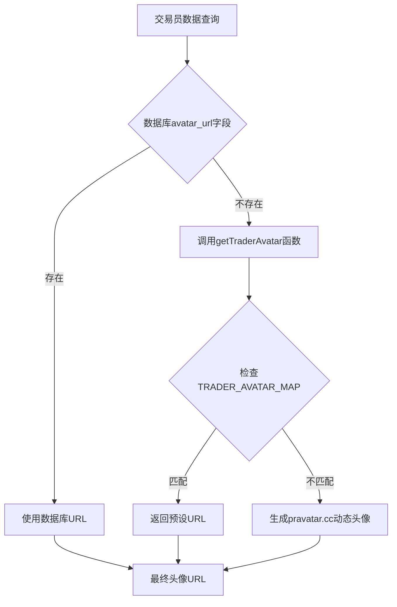
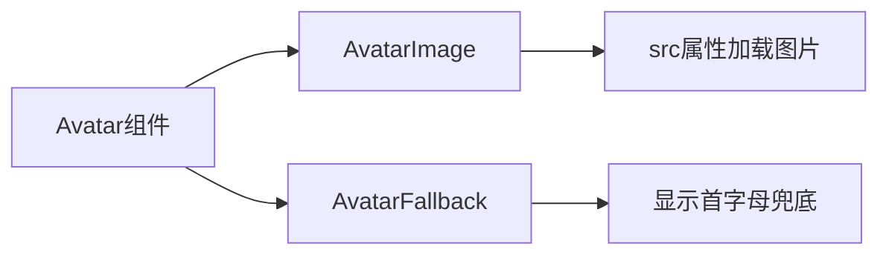
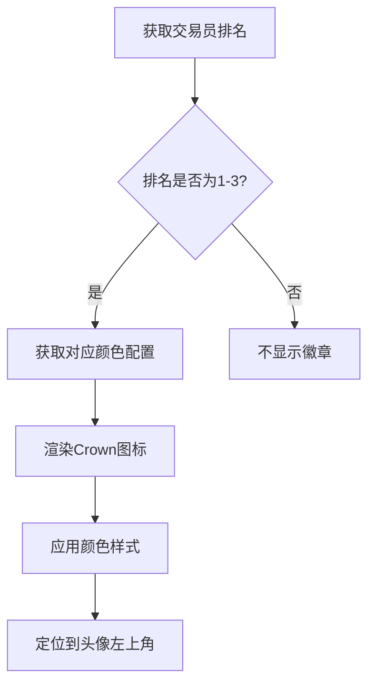
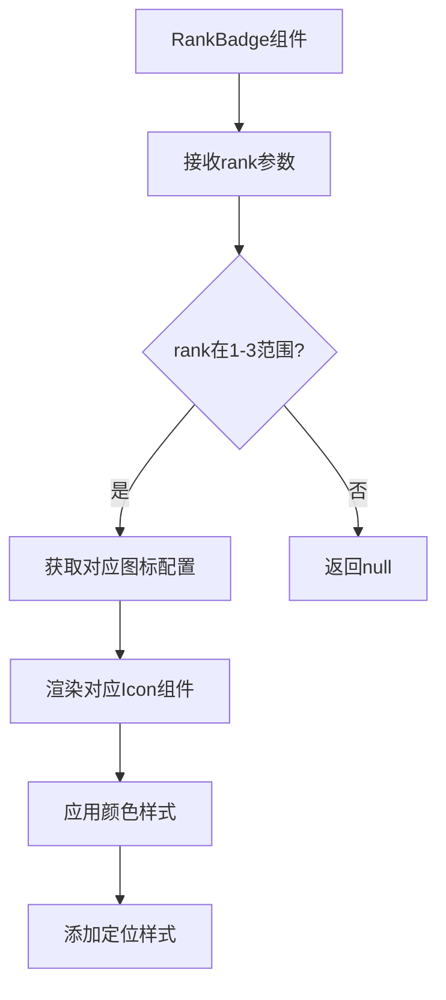
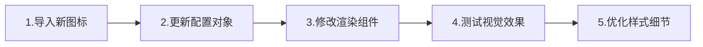

# 交易员头像数据源分析与排名标识设计

## 1. 概述

本文档分析当前GeneralSignal_H5项目中交易员头像的数据来源机制，并设计针对前三名交易员添加差异化排名标识图标的解决方案。

## 2. 头像数据源现状分析

### 2.1 头像获取机制

交易员头像数据通过以下层次获取：



### 2.2 数据源详细说明

#### 2.2.1 数据库存储
- **表名**: `public.traders`
- **字段**: `avatar_url`
- **类型**: TEXT（可选）

#### 2.2.2 映射配置文件
**位置**: `/src/lib/trader-avatars.ts`
```typescript
export const TRADER_AVATAR_MAP: Record<string, string> = {
  'WWG-Woods': 'https://i.pravatar.cc/150?u=wwg-woods',
  'WWG-Jonh': 'https://i.pravatar.cc/150?u=jonh',
  // ... 其他交易员映射
}
```

#### 2.2.3 动态生成机制
**兜底方案**: `https://i.pravatar.cc/150?u=${encodeURIComponent(name)}`

#### 2.2.4 Supabase存储桶
- **存储桶名**: `trader-avatars`
- **权限**: 公共读取
- **支持格式**: SVG、JPG、PNG、WebP
- **大小限制**: 5MB

### 2.3 头像渲染组件

头像在页面中通过以下组件渲染：



## 3. 当前排名标识分析

### 3.1 现有排名徽章系统

**配置位置**: `/src/app/page.tsx`
```typescript
const RANK_BADGES: {[key: number]: { color: string }} = {
    1: { color: "text-yellow-400" }, // 金色
    2: { color: "text-slate-400" },  // 银色  
    3: { color: "text-amber-600" },  // 铜色
}
```

### 3.2 徽章渲染逻辑



### 3.3 问题识别

当前所有前三名都使用相同的Crown图标，仅通过颜色区分：
- **冠军**: 金色Crown
- **亚军**: 银色Crown  
- **季军**: 铜色Crown

**用户痛点**: 图标形状相同，视觉区分度不够明显。

## 4. 排名标识改进设计

### 4.1 图标差异化方案

#### 4.1.1 图标选择策略

| 排名 | 图标类型 | 颜色 | 视觉寓意 |
|------|----------|------|----------|
| 第1名 | 👑 Crown | 金色 `text-yellow-400` | 王者地位 |
| 第2名 | 🥈 Medal | 银色 `text-slate-400` | 优秀表现 |
| 第3名 | 🏆 Trophy | 铜色 `text-amber-600` | 荣誉认可 |

#### 4.1.2 React图标组件映射

```typescript
const RANK_ICONS = {
    1: { Icon: Crown, color: "text-yellow-400", label: "冠军" },
    2: { Icon: Medal, color: "text-slate-400", label: "亚军" },
    3: { Icon: Trophy, color: "text-amber-600", label: "季军" }
}
```

### 4.2 组件架构设计



### 4.3 实现方案

#### 4.3.1 新增图标组件
从Lucide React导入所需图标：
```typescript
import { Crown, Medal, Trophy } from "lucide-react"
```

#### 4.3.2 配置更新
```typescript
const RANK_BADGES: {[key: number]: { 
    Icon: React.ComponentType<any>, 
    color: string,
    label: string 
}} = {
    1: { Icon: Crown, color: "text-yellow-400", label: "冠军" },
    2: { Icon: Medal, color: "text-slate-400", label: "亚军" },
    3: { Icon: Trophy, color: "text-amber-600", label: "季军" }
}
```

#### 4.3.3 渲染逻辑修改
```tsx
{badge && (
    <badge.Icon 
        className={`absolute -top-1 -left-1 h-6 w-6 transform -rotate-12 ${badge.color}`} 
        fill="currentColor"
        aria-label={badge.label}
    />
)}
```

### 4.4 移动端优化考虑

#### 4.4.1 尺寸适配
```typescript
const iconSize = {
    mobile: "h-5 w-5",  // 小屏幕
    desktop: "h-6 w-6"  // 大屏幕
}
```

#### 4.4.2 触摸友好设计
- 确保图标不遮挡重要交互区域
- 保持足够的视觉间距
- 考虑无障碍访问性

## 5. 技术实现路径

### 5.1 文件修改清单

| 文件路径 | 修改类型 | 描述 |
|----------|----------|------|
| `/src/app/page.tsx` | 更新 | 修改RANK_BADGES配置和渲染逻辑 |
| `/src/app/trader/[id]/page.tsx` | 更新 | 同步详情页排名标识 |

### 5.2 实现步骤



### 5.3 兼容性考虑

- **向后兼容**: 保持现有颜色方案
- **渐进增强**: 图标不可用时降级到纯色块
- **性能影响**: 最小化，仅增加图标组件导入

## 6. 用户体验优化

### 6.1 视觉层次
- **第一名**: 最醒目的Crown + 金色
- **第二名**: 适中的Medal + 银色
- **第三名**: 温和的Trophy + 铜色

### 6.2 信息传达
每个图标都有明确的等级语义：
- Crown象征最高荣誉
- Medal表示优秀成绩
- Trophy代表值得认可的成就

### 6.3 一致性保证
确保榜单页面和详情页面使用相同的标识系统。

## 7. 测试策略

### 7.1 视觉回归测试
- 不同排名的图标显示
- 各种屏幕尺寸下的效果
- 深色/浅色主题适配

### 7.2 功能测试
- 排名计算准确性
- 图标切换逻辑
- 无障碍访问验证

### 7.3 性能测试
- 图标加载时间
- 渲染性能影响
- 内存使用情况```typescript
const RANK_BADGES: {[key: number]: { 
    Icon: React.ComponentType<any>, 
    color: string,
    label: string 
}} = {
    1: { Icon: Crown, color: "text-yellow-400", label: "冠军" },
    2: { Icon: Medal, color: "text-slate-400", label: "亚军" },
    3: { Icon: Trophy, color: "text-amber-600", label: "季军" }
}
```

#### 4.3.3 渲染逻辑修改
```tsx
{badge && (
    <badge.Icon 
        className={`absolute -top-1 -left-1 h-6 w-6 transform -rotate-12 ${badge.color}`} 
        fill="currentColor"
        aria-label={badge.label}
    />
)}
```

### 4.4 移动端优化考虑

#### 4.4.1 尺寸适配
```typescript
const iconSize = {
    mobile: "h-5 w-5",  // 小屏幕
    desktop: "h-6 w-6"  // 大屏幕
}
```

#### 4.4.2 触摸友好设计
- 确保图标不遮挡重要交互区域
- 保持足够的视觉间距
- 考虑无障碍访问性

## 5. 技术实现路径

### 5.1 文件修改清单

| 文件路径 | 修改类型 | 描述 |
|----------|----------|------|
| `/src/app/page.tsx` | 更新 | 修改RANK_BADGES配置和渲染逻辑 |
| `/src/app/trader/[id]/page.tsx` | 更新 | 同步详情页排名标识 |

### 5.2 实现步骤


### 5.3 兼容性考虑

- **向后兼容**: 保持现有颜色方案
- **渐进增强**: 图标不可用时降级到纯色块
- **性能影响**: 最小化，仅增加图标组件导入

## 6. 用户体验优化

### 6.1 视觉层次
- **第一名**: 最醒目的Crown + 金色
- **第二名**: 适中的Medal + 银色
- **第三名**: 温和的Trophy + 铜色

### 6.2 信息传达
每个图标都有明确的等级语义：
- Crown象征最高荣誉
- Medal表示优秀成绩
- Trophy代表值得认可的成就

### 6.3 一致性保证
确保榜单页面和详情页面使用相同的标识系统。

## 7. 测试策略

### 7.1 视觉回归测试
- 不同排名的图标显示
- 各种屏幕尺寸下的效果
- 深色/浅色主题适配

### 7.2 功能测试
- 排名计算准确性
- 图标切换逻辑
- 无障碍访问验证

### 7.3 性能测试
- 图标加载时间
- 渲染性能影响
- 内存使用情况


