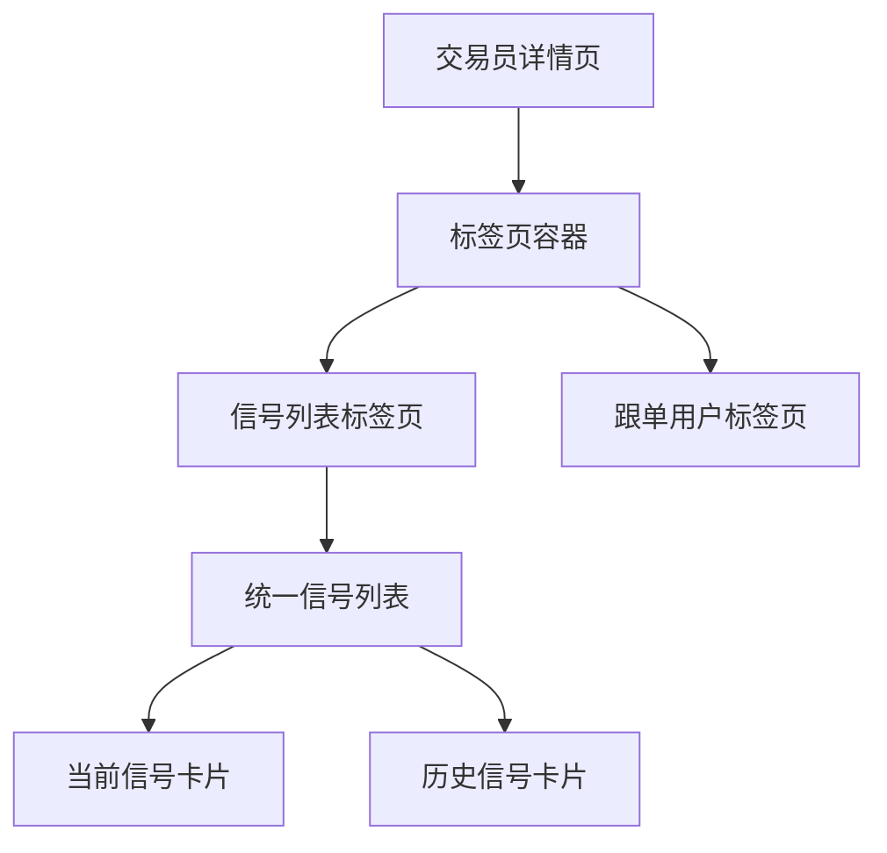
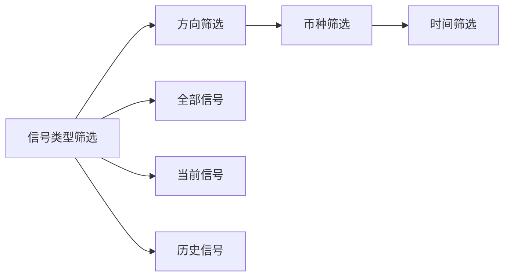
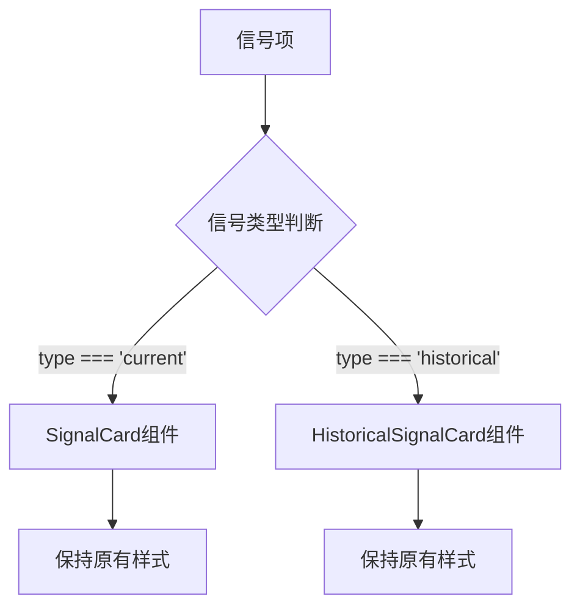
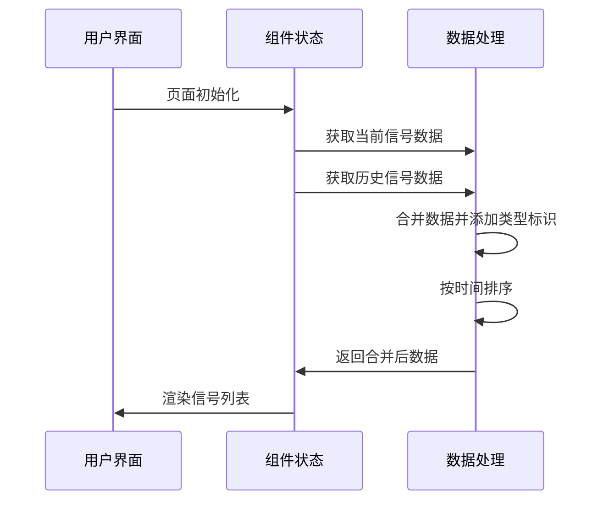
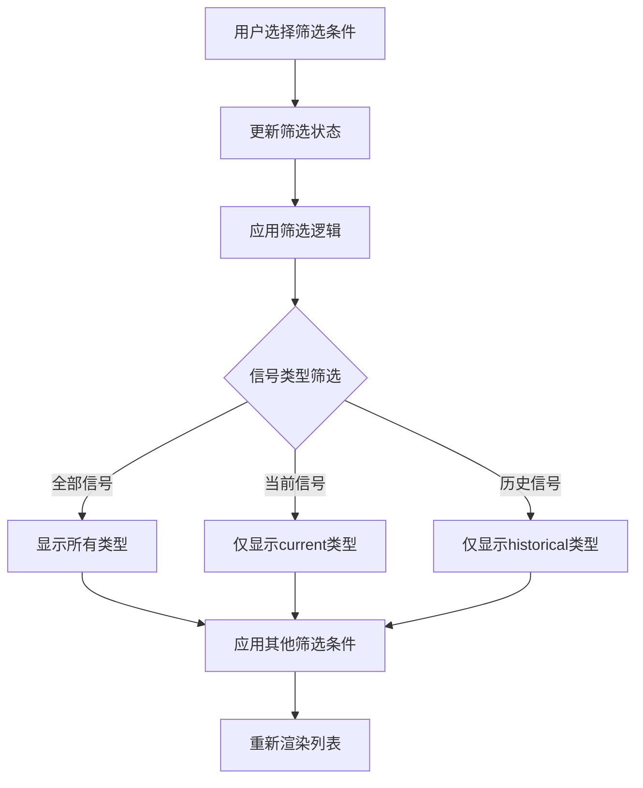

# 交易员详情页信号列表合并设计文档

## 概述

本设计文档描述了将交易员详情页中的"当前信号"和"历史信号"两个独立标签页合并为一个"信号列表"标签页的功能改进。该改进旨在提供更统一的用户体验，同时保持现有信号卡片的样式和功能不变。

## 需求分析

### 当前状态
- 交易员详情页包含三个标签页：当前信号、历史信号、跟单用户
- 当前信号和历史信号分别独立显示，使用不同的UI组件
- 当前信号使用 `SignalCard` 组件，历史信号使用 `HistoricalSignalCard` 组件
- 两个标签页都有独立的筛选器和分页加载功能

### 目标状态
- 将"当前信号"和"历史信号"合并为一个"信号列表"标签页
- 在合并后的列表中保持两种信号类型的原有样式
- 维持现有的筛选和分页功能
- 保持"跟单用户"标签页独立

## 技术架构

### 组件结构重构

#### 新的标签页配置


#### 数据结构设计

##### 合并后的信号数据类型
| 字段名 | 类型 | 描述 | 当前信号 | 历史信号 |
|--------|------|------|----------|----------|
| id | number | 信号唯一标识 | ✓ | ✓ |
| type | 'current' \| 'historical' | 信号类型 | 新增 | 新增 |
| pair | string | 交易对 | ✓ | ✓ |
| direction | string | 交易方向 | ✓ | ✓ |
| directionColor | string | 方向颜色 | ✓ | ✓ |
| entryPrice | string | 入场点位 | ✓ | ✓ |
| takeProfit1 | string \| null | 止盈点位1 | ✓ | ✓ |
| takeProfit2 | string \| null | 止盈点位2 | ✓ | ✓ |
| stopLoss | string | 止损点位 | ✓ | ✓ |
| pnlRatio | string | 盈亏比 | ✓ | ✓ |
| createdAt | string | 创建时间 | ✓ | ✓ |
| orderType | string | 订单类型 | ✓ | ✓ |
| marginMode | string | 保证金模式 | ✓ | ✓ |
| endedAt | string | 结束时间 | ✗ | ✓ |
| status | string | 交易状态 | ✗ | ✓ |

### 状态管理重构

#### 原有状态结构
```
- currentSignals: 当前信号数组
- historicalSignals: 历史信号数组
- currentSignalsPage: 当前信号分页
- historicalSignalsPage: 历史信号分页
- currentSignalsLoading: 当前信号加载状态
- historicalSignalsLoading: 历史信号加载状态
```

#### 新的状态结构
```
- allSignals: 合并后的信号数组
- signalsPage: 统一分页状态
- signalsLoading: 统一加载状态
- signalTypeFilter: 信号类型筛选器 ('all' | 'current' | 'historical')
```

## 界面设计

### 标签页布局

#### 更新后的标签配置
```
TABS = [
  { value: "signals", label: "信号列表", icon: BarChart },
  { value: "followers", label: "跟单用户", icon: Users }
]
```

### 筛选器设计

#### 筛选器组合


#### 筛选器配置表
| 筛选器 | 选项 | 默认值 |
|--------|------|--------|
| 信号类型 | 全部信号, 当前信号, 历史信号 | 全部信号 |
| 交易方向 | 全部方向, 做多, 做空 | 全部方向 |
| 交易币种 | 全部币种, BTC, ETH, SOL, DOGE, ADA, XRP, BNB, LINK | 全部币种 |
| 时间范围 | 近三个月, 近半年, 近一年 | 近三个月 |

### 信号卡片渲染逻辑

#### 动态组件选择


## 功能特性

### 核心功能

#### 信号列表统一展示
- 在单一列表中混合显示当前信号和历史信号
- 按时间倒序排列所有信号
- 根据信号类型自动选择对应的UI组件

#### 智能筛选系统
- **信号类型筛选**: 可选择查看全部信号、仅当前信号或仅历史信号
- **方向筛选**: 支持按做多/做空方向筛选
- **币种筛选**: 支持按特定交易对筛选
- **时间筛选**: 支持按时间范围筛选

#### 分页加载优化
- 合并两个独立的分页逻辑为统一的分页系统
- 保持无限滚动加载功能
- 优化数据获取和渲染性能

### 交互体验

#### 筛选器交互
- 信号类型筛选器位于最左侧，方便快速切换
- 其他筛选器保持原有布局和交互逻辑
- 筛选条件变更时自动重新加载列表

#### 滚动加载
- 维持原有的IntersectionObserver实现
- 统一的加载状态指示器
- 平滑的加载动画效果

## 实现方案

### 数据处理流程

#### 数据合并逻辑


#### 筛选处理逻辑


### 组件重构策略

#### 保持现有组件不变
- `SignalCard` 组件保持原有实现
- `HistoricalSignalCard` 组件保持原有实现
- `FilterDropdown` 组件保持原有实现

#### 新增组件
- `SignalTypeFilter` 组件：专门用于信号类型筛选
- `UnifiedSignalList` 组件：统一信号列表容器

#### 状态管理重构
- 移除独立的当前信号和历史信号状态
- 新增统一的信号列表状态
- 合并分页和加载状态管理

### 性能优化

#### 虚拟化列表
- 对于大量信号数据，考虑实现虚拟滚动
- 优化内存使用和渲染性能

#### 数据缓存
- 缓存已加载的信号数据
- 减少重复网络请求

#### 组件优化
- 使用React.memo优化信号卡片组件
- 实现键值优化的列表渲染

## 测试策略

### 功能测试

#### 信号列表显示测试
- [ ] 验证当前信号和历史信号正确混合显示
- [ ] 确认信号类型标识正确添加
- [ ] 验证按时间倒序排列逻辑

#### 筛选功能测试
- [ ] 测试信号类型筛选功能
- [ ] 验证方向筛选准确性
- [ ] 确认币种筛选效果
- [ ] 测试时间范围筛选

#### 分页加载测试
- [ ] 验证无限滚动正常工作
- [ ] 测试加载状态指示器
- [ ] 确认数据去重逻辑

### 样式兼容性测试

#### 信号卡片样式测试
- [ ] 验证当前信号卡片样式不变
- [ ] 确认历史信号卡片样式不变
- [ ] 测试两种卡片在同一列表中的视觉一致性

#### 响应式设计测试
- [ ] 测试不同屏幕尺寸下的布局
- [ ] 验证筛选器在移动端的可用性

### 性能测试

#### 渲染性能测试
- [ ] 测试大量信号数据的渲染性能
- [ ] 验证滚动流畅性
- [ ] 确认内存使用合理性

## 迁移计划

### 阶段一：数据结构改造
1. 扩展信号数据类型定义
2. 实现数据合并逻辑
3. 更新mock数据生成

### 阶段二：UI重构
1. 更新标签页配置
2. 实现统一信号列表组件
3. 添加信号类型筛选器

### 阶段三：状态管理重构
1. 合并信号相关状态
2. 统一分页逻辑
3. 优化加载性能

### 阶段四：测试和优化
1. 功能测试验证
2. 性能优化调整
3. 用户体验改进

## 风险评估

### 技术风险
- **数据同步风险**: 合并数据可能导致状态同步问题
- **性能风险**: 大量数据可能影响渲染性能
- **兼容性风险**: 现有组件可能需要适配调整

### 缓解措施
- 充分的单元测试和集成测试
- 渐进式重构，保持向后兼容
- 性能监控和优化

## 后续扩展

### 可能的功能扩展
- 信号搜索功能
- 自定义排序选项
- 信号比较功能
- 批量操作支持

### 技术债务清理
- 移除冗余的状态管理代码
- 优化组件结构
- 改进代码复用性