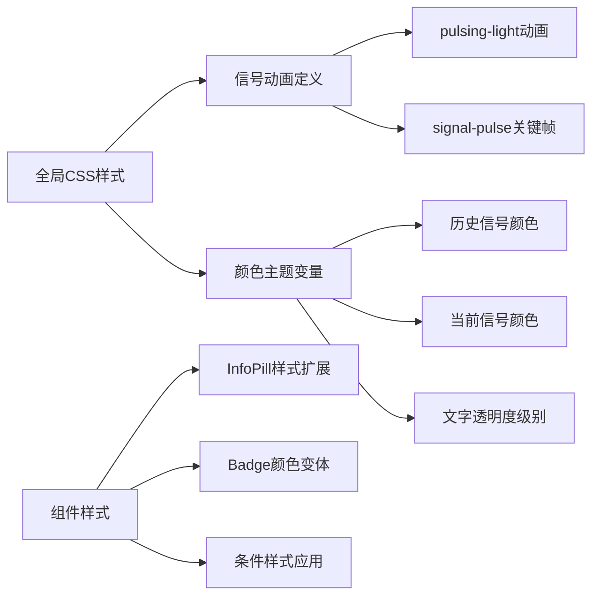

# 交易员信号列表样式优化设计

## 1. 概述

本设计旨在优化交易员详情页面中的信号列表显示，通过视觉差异化来区分历史信号与当前信号，提升用户对信号状态的识别体验。

## 2. 技术栈分析

### 2.1 前端架构
- **框架**: Next.js 15.3.3 + React 18
- **样式**: Tailwind CSS + 自定义CSS动画
- **UI组件**: Radix UI基础组件库
- **类型系统**: TypeScript

### 2.2 相关组件结构
```
src/app/trader/[id]/page.tsx
├── SignalCard (当前信号卡片)
├── HistoricalSignalCard (历史信号卡片)  
├── UnifiedSignalCard (统一信号卡片入口)
└── InfoPill (信息展示组件)
```

## 3. 功能需求分析

### 3.1 历史信号视觉降级
- **目标**: 历史信号的做多/做空文案显示更浅的颜色
- **当前状态**: 历史信号与当前信号使用相同的颜色强度
- **优化方向**: 通过透明度或颜色值调整实现视觉层级

### 3.2 当前信号状态标识增强
- **脉冲信号灯标识**: 在现有绿色脉冲点右侧添加"有效"文字
- **左侧信息突出**: 入场点位到创建时间的文案使用白色突出显示

### 3.3 信息层级设计原则
- 当前信号 > 历史信号的视觉权重
- 状态标识的直观性和可识别性
- 保持整体设计风格的一致性

## 4. 组件架构设计

### 4.1 信号卡片组件层级

```mermaid
graph TD
    A[UnifiedSignalCard] --> B{信号类型判断}
    B -->|current| C[SignalCard]
    B -->|historical| D[HistoricalSignalCard]
    
    C --> C1[脉冲状态指示器]
    C --> C2[高亮信息区域]
    C --> C3[做多/做空标识]
    
    D --> D1[降级信息区域]
    D --> D2[做多/做空标识-浅色]
    D --> D3[状态文字显示]
    
    C1 --> E[信号灯 + "有效"文字]
    C2 --> F[白色突出文案]
    D2 --> G[透明度调整颜色]
```

### 4.2 样式系统架构



## 5. 实现方案设计

### 5.1 历史信号做多/做空颜色调整

**方案**: 在`HistoricalSignalCard`中调整`directionColor`的透明度

**实现要点**:
- 检测信号方向颜色类名
- 应用透明度修饰符降低视觉权重
- 保持颜色语义的可识别性

### 5.2 当前信号"有效"标识

**方案**: 扩展现有脉冲信号灯组件，添加文字标识

**核心组件**:
```tsx
// 有效信号指示器组件
interface ActiveSignalIndicatorProps {
  className?: string;
}

// 脉冲信号灯 + "有效"文字的组合组件
```

### 5.3 当前信号信息突出显示

**方案**: 为`InfoPill`组件添加样式变体支持

**扩展接口**:
```tsx
interface InfoPillProps {
  label: string;
  value: string | number | null | undefined;
  action?: React.ReactNode;
  variant?: 'default' | 'highlighted'; // 新增样式变体
  labelClassName?: string; // 自定义标签样式
  valueClassName?: string; // 自定义值样式
}
```

## 6. 样式规范定义

### 6.1 颜色透明度层级

| 信号状态 | 做多/做空颜色 | 透明度 | CSS类名示例 |
|---------|-------------|-------|------------|
| 当前信号 | 标准颜色 | 100% | `text-green-400` |
| 历史信号 | 降级颜色 | 60% | `text-green-400/60` |

### 6.2 信息显示层级

| 元素类型 | 当前信号样式 | 历史信号样式 |
|---------|------------|------------|
| 交易对文字 | `text-primary` | `text-muted-foreground` |
| 信息标签 | `text-foreground` | `text-muted-foreground` |
| 数值显示 | `text-foreground` | `text-foreground` |
| 状态指示 | 脉冲灯+"有效" | 状态文字 |

### 6.3 脉冲动画规范

**现有动画保持**: 
- `signal-pulse` 关键帧动画
- 2秒循环周期
- 绿色(#4ade80)脉冲效果

**新增文字样式**:
- 颜色: `text-green-400`
- 字体大小: `text-xs`
- 字重: `font-medium`

## 7. 组件接口设计

### 7.1 ActiveSignalIndicator组件

```tsx
interface ActiveSignalIndicatorProps {
  size?: 'sm' | 'md' | 'lg';
  showLabel?: boolean;
  labelText?: string;
  className?: string;
}
```

**默认配置**:
- `size`: 'md' (10px脉冲点)
- `showLabel`: true
- `labelText`: '有效'

### 7.2 InfoPill组件扩展

```tsx
interface InfoPillProps {
  label: string;
  value: string | number | null | undefined;
  action?: React.ReactNode;
  variant?: 'default' | 'highlighted';
  className?: string;
}
```

**样式变体**:
- `default`: 当前样式保持不变
- `highlighted`: 标签和值都使用`text-foreground`

## 8. 实现步骤

### 8.1 第一阶段: 样式基础
1. 创建`ActiveSignalIndicator`组件
2. 扩展`InfoPill`组件支持`highlighted`变体
3. 定义历史信号颜色透明度CSS工具类

### 8.2 第二阶段: 组件集成
1. 修改`SignalCard`集成新的状态指示器
2. 修改`HistoricalSignalCard`应用降级样式
3. 更新`InfoPill`调用点应用新变体

### 8.3 第三阶段: 样式调优
1. 测试不同屏幕尺寸下的显示效果
2. 验证颜色对比度满足可访问性要求
3. 优化动画性能和流畅度

## 9. 测试策略

### 9.1 视觉回归测试
- 对比优化前后的信号卡片显示效果
- 验证历史信号与当前信号的视觉区分度
- 确认脉冲动画和"有效"标识的正确显示

### 9.2 响应式测试
- 测试移动端(375px)显示效果
- 验证平板端(768px)布局适配
- 确认桌面端(1024px+)的视觉一致性

### 9.3 交互体验测试
- 验证信号状态切换的视觉反馈
- 测试长文本内容的显示处理
- 确认颜色对比度符合WCAG标准

## 10. 性能考虑

### 10.1 CSS优化
- 利用Tailwind CSS的JIT模式减少未使用样式
- 复用现有动画关键帧避免重复定义
- 使用CSS变量支持主题切换

### 10.2 组件性能
- `ActiveSignalIndicator`组件使用`React.memo`优化
- 避免在渲染循环中创建内联样式对象
- 条件样式应用使用`clsx`或`cn`工具函数

## 11. 维护性设计

### 11.1 样式抽象
- 将颜色透明度级别定义为语义化CSS类
- 使用CSS自定义属性支持主题定制
- 保持样式命名的一致性和可预测性

### 11.2 组件复用
- `ActiveSignalIndicator`可复用于其他需要状态指示的场景
- `InfoPill`的变体系统支持未来扩展需求
- 样式规范可应用于其他类似的列表组件


