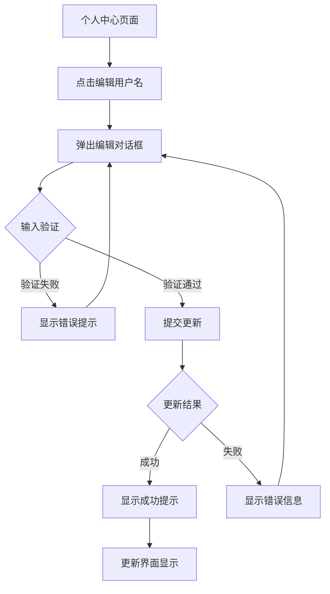
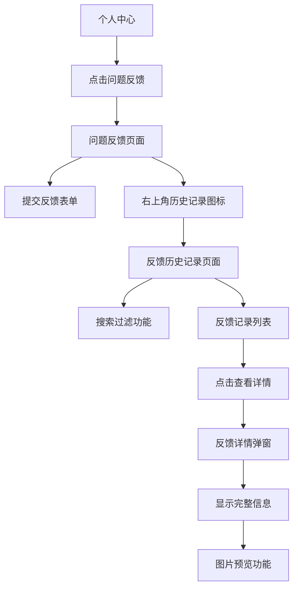
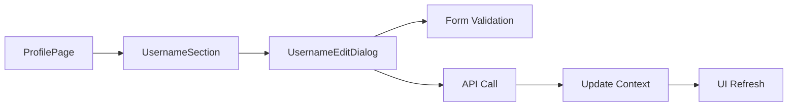
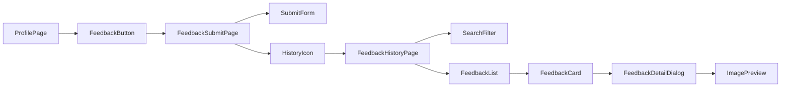
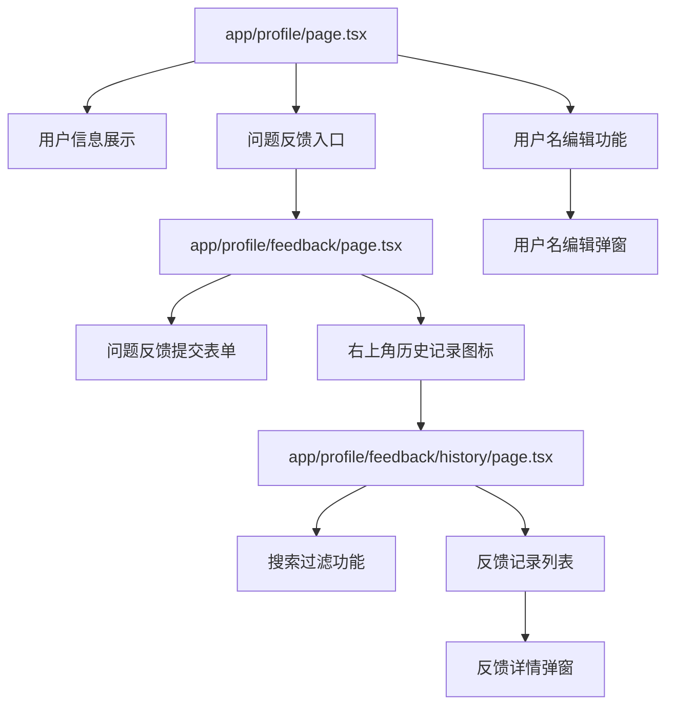

# 用户名修改及问题反馈历史记录功能设计

## 概述

本设计文档针对 GeneralSignal_H5 项目，实现两个核心用户功能：
1. **用户名自主修改功能** - 允许用户更改显示名称，并遵循注册时的长度限制
2. **问题反馈历史记录功能** - 提供用户查看自己提交的反馈记录，包括问题类型、描述和图片

## 技术架构

### 系统环境
- **前端框架**: Next.js 15 (App Router)
- **UI组件**: Radix UI + Tailwind CSS
- **后端服务**: Supabase (PostgreSQL + Auth + Storage)
- **状态管理**: React Context + Hooks
- **表单验证**: React Hook Form + Zod

### 数据库设计

#### 现有表结构
```sql
-- profiles 表（已存在）
CREATE TABLE public.profiles (
  id uuid REFERENCES auth.users(id) ON DELETE CASCADE PRIMARY KEY,
  username text,                    -- 用户名字段
  email text NOT NULL,
  avatar_url text,
  website text,
  invitation_code text,
  membership_level public.membership_level DEFAULT 'free' NOT NULL,
  created_at timestamptz NOT NULL DEFAULT timezone('utc'::text, now()),
  updated_at timestamptz NOT NULL DEFAULT timezone('utc'::text, now())
);

-- feedbacks 表（已存在）
CREATE TABLE public.feedbacks (
  id uuid PRIMARY KEY DEFAULT gen_random_uuid(),
  user_id uuid NOT NULL DEFAULT auth.uid(),
  categories text[] NOT NULL,        -- 问题类型数组
  description text NOT NULL,         -- 问题描述
  images jsonb NOT NULL DEFAULT '[]'::jsonb,  -- 反馈图片路径
  contact text NULL,
  env jsonb NULL,
  status text NOT NULL DEFAULT 'pending',
  created_at timestamptz NOT NULL DEFAULT timezone('utc'::text, now()),
  updated_at timestamptz NOT NULL DEFAULT timezone('utc'::text, now())
);
```

## 功能设计

### 1. 用户名修改功能

#### 功能描述
- 用户可以在个人中心页面修改显示名称
- 采用与注册时相同的验证规则（最多6个字符）
- 提供即时验证反馈
- 支持重复用户名（与当前系统设计保持一致）

#### 界面设计



#### 组件结构
```typescript
// 用户名编辑组件
interface UsernameEditDialogProps {
  currentUsername: string;
  onUsernameUpdate: (newUsername: string) => void;
}

// 表单验证规则
const usernameSchema = z.object({
  username: z.string()
    .min(1, "用户名不能为空")
    .max(6, "用户名不能超过6个字符")
    .trim()
});
```

#### API设计
```typescript
// 更新用户名接口
export async function updateUsername(userId: string, newUsername: string) {
  const { data, error } = await supabase
    .from('profiles')
    .update({ 
      username: newUsername.trim(),
      updated_at: new Date().toISOString()
    })
    .eq('id', userId)
    .select();
  
  return { data, error };
}
```

### 2. 问题反馈历史记录功能

#### 功能描述
- 在问题反馈页面的右上角添加历史记录查看入口（图标按钮）
- 参考邀请记录页面的设计模式，独立的历史记录页面
- 显示用户提交的所有问题反馈记录
- 支持查看反馈详情，包括图片预览
- 按时间倒序展示，支持分页加载
- 支持搜索功能（按问题描述或类型筛选）

#### 界面设计



#### 数据展示结构
```typescript
interface FeedbackRecord {
  id: string;
  categories: string[];           // 问题类型
  description: string;           // 问题描述  
  images: string[];             // 图片路径数组
  status: 'pending' | 'processing' | 'resolved' | 'closed';
  created_at: string;
  updated_at: string;
}

interface FeedbackListResponse {
  data: FeedbackRecord[];
  total: number;
  hasMore: boolean;
}
```

#### 问题类型映射
```typescript
const FEEDBACK_TYPE_LABELS = {
  'feature': '功能建议',
  'ui': '界面问题', 
  'account': '账号问题',
  'other': '其他问题'
} as const;
```

## 组件架构

### 1. 用户名编辑组件



#### 核心组件

**UsernameEditDialog.tsx**
```typescript
interface Props {
  isOpen: boolean;
  onClose: () => void;
  currentUsername: string;
  onUpdate: (username: string) => Promise<void>;
}
```

**UsernameSection.tsx**
```typescript
interface Props {
  username: string;
  onUsernameChange: (newUsername: string) => void;
}
```

### 2. 问题反馈页面组件



#### 核心组件

**FeedbackSubmitPage.tsx**
```typescript
interface Props {
  userId: string;
}
```

**FeedbackHistoryPage.tsx**
```typescript
interface Props {
  userId: string;
}
```

**FeedbackHistoryHeader.tsx**
```typescript
interface Props {
  title: string;
  onBack: () => void;
  onRefresh: () => void;
  loading?: boolean;
}
```

**FeedbackCard.tsx**
```typescript
interface Props {
  feedback: FeedbackRecord;
  onViewDetail: (id: string) => void;
}
```

**FeedbackDetailDialog.tsx**
```typescript
interface Props {
  feedback: FeedbackRecord | null;
  isOpen: boolean;
  onClose: () => void;
}
```

## API规范

### 用户名更新API

```typescript
// PUT /api/profile/username
interface UpdateUsernameRequest {
  username: string;
}

interface UpdateUsernameResponse {
  success: boolean;
  data?: {
    username: string;
    updated_at: string;
  };
  error?: string;
}
```

### 反馈历史查询API

```typescript
// GET /api/feedback/history?page=1&limit=10&search=
interface FeedbackHistoryQuery {
  page: number;
  limit: number;
  search?: string;  // 搜索关键词（问题描述）
  status?: string;  // 反馈状态过滤
}

interface FeedbackHistoryResponse {
  success: boolean;
  data: {
    records: FeedbackRecord[];
    pagination: {
      page: number;
      limit: number;
      total: number;
      hasMore: boolean;
    };
  };
  error?: string;
}
```

### 页面布局规范

#### 问题反馈提交页面布局
```typescript
// Header Layout (参考邀请页面)
interface FeedbackPageHeader {
  leftButton: BackButton;      // 返回个人中心
  title: "问题反馈";           // 页面标题
  rightButton: HistoryIconButton; // 历史记录图标（Clock或FileText图标）
}

// Main Content Layout
interface FeedbackSubmitLayout {
  form: FeedbackSubmissionForm;
  rules: FeedbackRulesCard;    // 反馈须知说明
}
```

#### 反馈历史记录页面布局
```typescript
// Header Layout (参考邀请记录页面)
interface FeedbackHistoryHeader {
  leftButton: BackButton;       // 返回反馈页面
  title: "反馈记录";
  rightButton: RefreshButton;   // 刷新按钮
}

// Search Filter Layout
interface SearchFilterSection {
  searchInput: SearchInput;     // 搜索输入框
  clearButton?: ClearButton;    // 清除搜索按钮
}

// List Layout
interface FeedbackListLayout {
  pullToRefresh: PullRefreshIndicator;
  records: FeedbackCard[];
  loadMore: LoadMoreButton;
  emptyState?: EmptyStateMessage;
}
```

### 反馈卡片设计规范

```typescript
// FeedbackCard 组件设计（参考邀请记录卡片）
interface FeedbackCardProps {
  feedback: FeedbackRecord;
  onViewDetail: (id: string) => void;
}

// 卡片内容结构
interface FeedbackCardContent {
  header: {
    types: FeedbackTypeChips[];    // 问题类型标签
    status: StatusBadge;           // 状态徽章
    timestamp: string;             // 提交时间
  };
  body: {
    description: TruncatedText;    // 截断的问题描述
    imageCount?: number;           // 图片数量提示
  };
  actions: {
    viewDetail: ViewDetailButton;  // 查看详情按钮
  };
}
```

### 详情弹窗设计

```typescript
// FeedbackDetailDialog 组件设计
interface FeedbackDetailDialogProps {
  feedback: FeedbackRecord | null;
  isOpen: boolean;
  onClose: () => void;
}

// 详情内容结构
interface FeedbackDetailContent {
  header: {
    title: "反馈详情";
    closeButton: CloseButton;
  };
  content: {
    types: FeedbackTypeList;       // 问题类型列表
    description: FullDescription;   // 完整问题描述
    images: ImageGallery;          // 图片画廊组件
    metadata: {
      submitTime: string;
      status: string;
      contact?: string;
    };
  };
}
```

### 反馈历史查询API

```typescript
// GET /api/feedback/history?page=1&limit=10&search=
interface FeedbackHistoryQuery {
  page: number;
  limit: number;
  search?: string;  // 搜索关键词（问题描述）
  status?: string;  // 反馈状态过滤
}

interface FeedbackHistoryResponse {
  success: boolean;
  data: {
    records: FeedbackRecord[];
    pagination: {
      page: number;
      limit: number;
      total: number;
      hasMore: boolean;
    };
  };
  error?: string;
}
```

### 页面布局规范

#### 问题反馈提交页面布局
```typescript
// Header Layout (参考邀请页面)
interface FeedbackPageHeader {
  leftButton: BackButton;      // 返回个人中心
  title: "问题反馈";           // 页面标题
  rightButton: HistoryIconButton; // 历史记录图标（Clock或FileText图标）
}

// Main Content Layout
interface FeedbackSubmitLayout {
  form: FeedbackSubmissionForm;
  rules: FeedbackRulesCard;    // 反馈须知说明
}
```

#### 反馈历史记录页面布局
```typescript
// Header Layout (参考邀请记录页面)
interface FeedbackHistoryHeader {
  leftButton: BackButton;       // 返回反馈页面
  title: "反馈记录";
  rightButton: RefreshButton;   // 刷新按钮
}

// Search Filter Layout
interface SearchFilterSection {
  searchInput: SearchInput;     // 搜索输入框
  clearButton?: ClearButton;    // 清除搜索按钮
}

// List Layout
interface FeedbackListLayout {
  pullToRefresh: PullRefreshIndicator;
  records: FeedbackCard[];
  loadMore: LoadMoreButton;
  emptyState?: EmptyStateMessage;
}
```

## 页面路由设计

### 路由结构
```
/profile                    # 个人中心主页
├── username-edit           # 用户名编辑（弹窗形式）
├── feedback               # 问题反馈提交页面
└── feedback/history       # 反馈历史记录页面
    └── ?detail=[id]       # 反馈详情（弹窗形式）
```

### 页面组件关系


## 状态管理

### AuthContext扩展
```typescript
interface AuthContextType {
  // 现有字段...
  updateUserProfile: (updates: Partial<UserProfile>) => Promise<void>;
  refreshUserProfile: () => Promise<void>;
}

interface UserProfile {
  id: string;
  username: string;
  email: string;
  avatar_url?: string;
  membership_level: string;
}
```

### 本地状态管理
```typescript
// 个人中心页面状态
interface ProfilePageState {
  profile: UserProfile | null;
  isLoading: boolean;
  editDialogOpen: boolean;
  feedbackHistoryOpen: boolean;
}

// 问题反馈提交页面状态  
interface FeedbackSubmitState {
  form: {
    categories: string[];
    description: string;
    images: File[];
    submitting: boolean;
  };
}

// 反馈历史页面状态
interface FeedbackHistoryState {
  records: FeedbackRecord[];
  loading: boolean;
  hasMore: boolean;
  searchQuery: string;
  selectedFeedback: FeedbackRecord | null;
  detailDialogOpen: boolean;
  refreshing: boolean;
}
```

## 验证规则

### 用户名验证
```typescript
const USERNAME_VALIDATION = {
  required: "用户名不能为空",
  maxLength: {
    value: 6,
    message: "用户名不能超过6个字符"
  },
  pattern: {
    value: /^.{1,6}$/,
    message: "用户名长度必须在1-6个字符之间"
  }
};
```

### 表单验证Schema
```typescript
const usernameSchema = z.object({
  username: z.string()
    .min(1, "用户名不能为空") 
    .max(6, "用户名输入过长，请重新输入（最多6个字符）")
    .trim()
});
```

## 用户体验设计

### 交互流程

#### 用户名修改流程
1. 用户在个人中心点击用户名旁的编辑图标
2. 弹出编辑对话框，显示当前用户名
3. 用户输入新用户名，实时显示字符计数
4. 表单验证不通过时显示错误提示
5. 验证通过后提交，显示加载状态
6. 成功后显示提示并更新界面，失败则显示错误信息

#### 问题反馈功能流程
1. 用户在个人中心点击"问题反馈"按钮
2. 进入问题反馈提交页面，右上角显示历史记录图标（类似邀请页面的设计）
3. 用户填写反馈表单并提交
4. 提交成功后显示成功提示
5. 用户可点击右上角历史记录图标查看历史记录
6. 在历史记录页面中：
   - 支持搜索功能（按问题描述筛选）
   - 显示反馈列表，按时间倒序
   - 每条记录显示：问题类型、部分描述、提交时间、状态
   - 点击记录查看详情，弹出详细信息对话框
   - 详情中可预览反馈图片，支持放大查看
   - 支持下拉刷新和分页加载

### 响应式设计适配
- **桌面端**: 使用对话框形式进行编辑操作
- **移动端**: 优化触摸操作，确保按钮大小合适
- **平板端**: 自适应布局，保持良好的视觉层次

### 加载状态设计
- 提交时显示加载指示器
- 图片加载时显示骨架屏
- 长列表支持分页或无限滚动

## 错误处理

### 用户名修改错误处理
```typescript
const handleUsernameUpdate = async (newUsername: string) => {
  try {
    const result = await updateUsername(userId, newUsername);
    if (result.error) {
      toast({
        title: "更新失败",
        description: result.error.message || "用户名更新失败，请重试",
        variant: "destructive"
      });
    } else {
      toast({
        title: "更新成功", 
        description: "用户名已更新"
      });
      // 更新本地状态
      setProfile(prev => ({ ...prev, username: newUsername }));
    }
  } catch (error) {
    toast({
      title: "网络错误",
      description: "请检查网络连接后重试",
      variant: "destructive"
    });
  }
};
```

### 反馈历史错误处理
```typescript
const loadFeedbackHistory = async (page: number = 1) => {
  try {
    setLoading(true);
    const { data, error } = await supabase
      .from('feedbacks')
      .select('*')
      .eq('user_id', userId)
      .order('created_at', { ascending: false })
      .range((page - 1) * PAGE_SIZE, page * PAGE_SIZE - 1);
      
    if (error) throw error;
    
    setRecords(prev => page === 1 ? data : [...prev, ...data]);
    setHasMore(data.length === PAGE_SIZE);
  } catch (error) {
    toast({
      title: "加载失败",
      description: "反馈历史加载失败，请重试",
      variant: "destructive"
    });
  } finally {
    setLoading(false);
  }
};
```

## 安全考虑

### 数据访问控制
- **RLS策略**: 确保用户只能查看和修改自己的数据
- **输入验证**: 前后端双重验证，防止恶意输入
- **权限检查**: 确认用户身份后才允许操作

### 防护措施
```sql
-- profiles表RLS策略（已存在）
CREATE POLICY "Users can update own profile" ON profiles
  FOR UPDATE USING (auth.uid() = id);

-- feedbacks表RLS策略（已存在）  
CREATE POLICY "feedbacks_select_own" ON feedbacks
  FOR SELECT TO authenticated USING (auth.uid() = user_id);
```

## 测试策略

### 单元测试
- 用户名验证逻辑测试
- API调用错误处理测试
- 组件状态管理测试

### 集成测试
- 用户名修改完整流程测试
- 反馈历史查询和展示测试
- 图片预览功能测试

### 用户接受测试
- 用户名修改功能可用性测试
- 反馈历史查看体验测试
- 移动端适配测试


