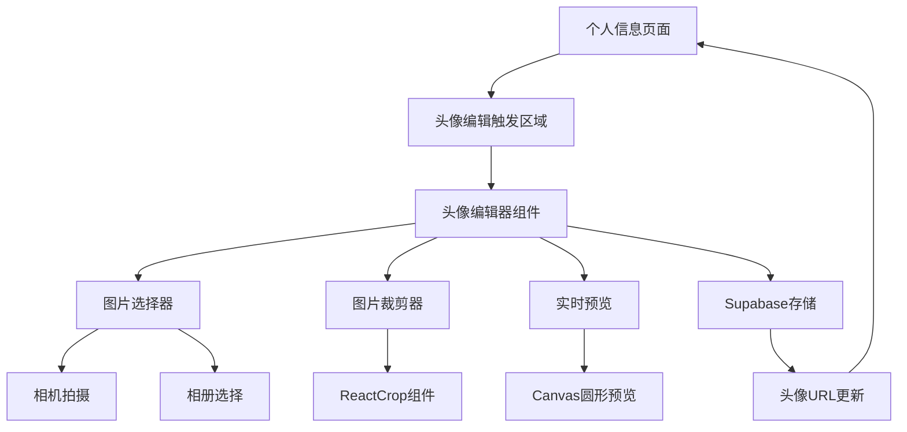
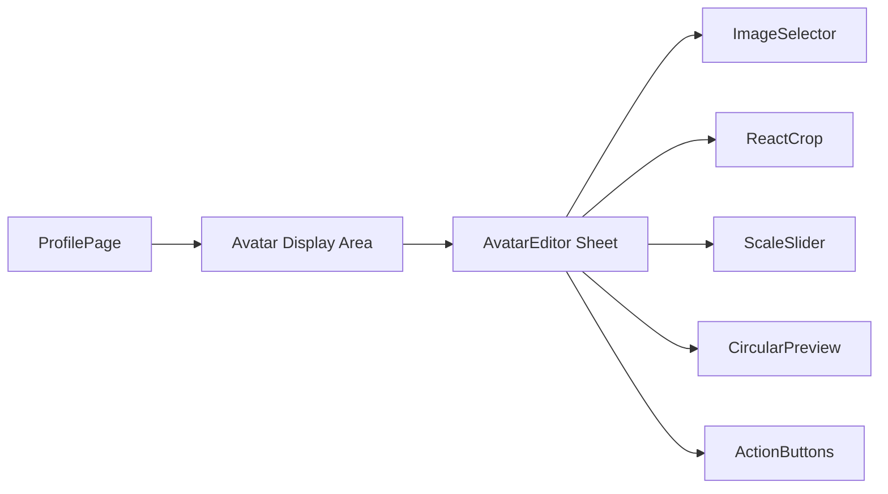
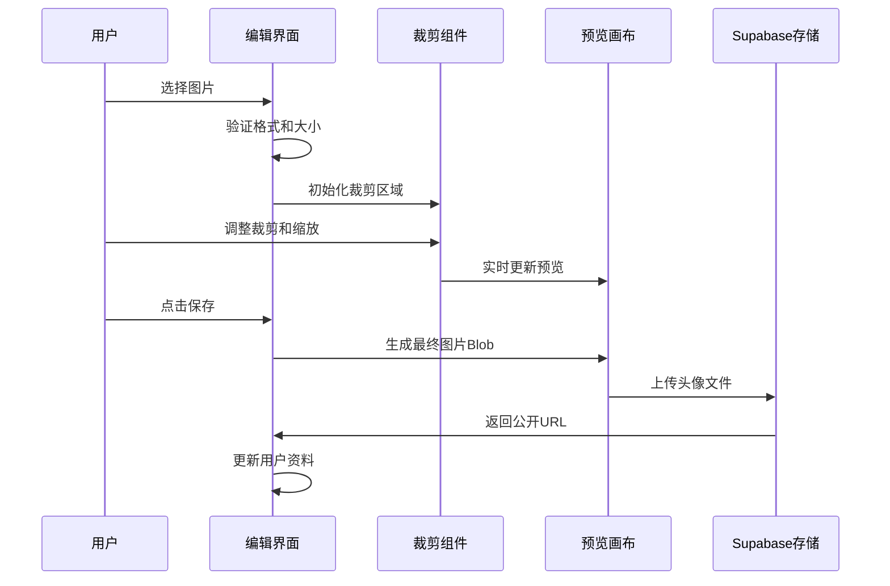
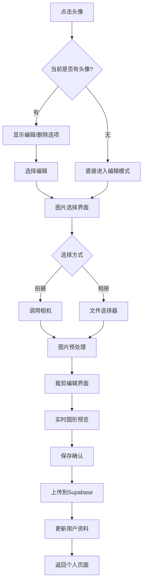
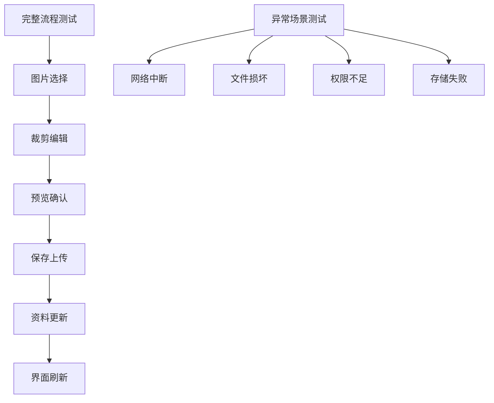

# 个人信息页头像编辑功能设计

## 概述

本设计文档描述了在个人信息页面中添加头像编辑功能的实现方案。该功能允许用户上传、裁剪和管理个人头像，并与Supabase存储桶进行联动，提供完整的头像管理体验。

### 核心目标
- 为用户提供便捷的头像上传和编辑功能
- 集成Supabase Storage实现头像文件存储
- 支持图片裁剪和缩放功能
- 提供圆形头像预览和展示
- 确保图片格式和大小限制

## 技术架构

### 前端架构



### 组件层次结构



## 组件设计

### 1. 个人信息页面头像区域增强

**位置**: `src/app/profile/page.tsx`

现有头像显示区域需要添加编辑触发功能：

| 组件元素 | 功能描述 | 交互行为 |
|----------|----------|----------|
| Avatar组件 | 显示当前用户头像 | 点击触发编辑器 |
| 编辑图标 | 视觉提示可编辑 | 悬停显示，点击触发 |
| 占位符头像 | 无头像时的默认显示 | 显示上传提示 |

### 2. AvatarEditor组件架构

**位置**: `src/app/components/AvatarEditor.tsx`

#### 组件属性接口

```typescript
interface AvatarEditorProps {
  open: boolean
  onOpenChange: (open: boolean) => void
  userId: string
  currentUrl?: string | null
  onUploaded: (url: string) => void
}
```

#### 核心功能模块

| 模块 | 功能 | 实现技术 |
|------|------|----------|
| 图片选择 | 相机拍摄/相册选择 | HTML5 File Input |
| 图片裁剪 | 自由裁剪和缩放 | ReactCrop库 |
| 实时预览 | 圆形头像预览 | Canvas API |
| 存储上传 | 头像文件保存 | Supabase Storage |

#### 状态管理

```typescript
// 主要状态
const [fileUrl, setFileUrl] = useState<string | null>(null)
const [imgEl, setImgEl] = useState<HTMLImageElement | null>(null)
const [crop, setCrop] = useState<PercentCrop>({
  unit: "%", width: 70, height: 70, x: 15, y: 15
})
const [scale, setScale] = useState(1)
const [saving, setSaving] = useState(false)
```

### 3. 图片处理工作流



## 数据模型

### Supabase存储结构

#### Storage Bucket配置
```sql
-- 头像存储桶
Bucket Name: avatars
Public: true
File Size Limit: 5MB
Allowed MIME Types: image/jpeg, image/png, image/webp
```

#### 文件路径规范
```
avatars/
├── {userId}/
│   ├── {timestamp}.jpg
│   └── {timestamp}.jpg
```

### 数据库Schema

#### profiles表更新
```sql
-- 用户资料表头像字段
ALTER TABLE profiles 
ADD COLUMN IF NOT EXISTS avatar_url TEXT;

-- 索引优化
CREATE INDEX IF NOT EXISTS idx_profiles_avatar_url 
ON profiles(avatar_url) WHERE avatar_url IS NOT NULL;
```

## 功能特性

### 图片限制规则

| 限制类型 | 规则 | 验证时机 |
|----------|------|----------|
| 文件格式 | JPEG, PNG, WebP | 选择时验证 |
| 文件大小 | ≤ 5MB | 选择时验证 |
| 图片尺寸 | 最小100x100px | 裁剪时验证 |
| 输出格式 | JPEG (90%质量) | 保存时统一 |

### 裁剪和缩放功能

| 功能 | 参数范围 | 默认值 |
|------|----------|--------|
| 裁剪比例 | 1:1 (正方形) | 固定 |
| 缩放倍数 | 0.5x - 3.0x | 1.0x |
| 输出尺寸 | 400x400px | 固定 |
| 预览尺寸 | 160x160px | 固定 |

### 用户体验设计

#### 交互流程



#### 视觉设计规范

| 元素 | 设计规范 | 主题适配 |
|------|----------|----------|
| 头像边框 | 2px primary/50 | 跟随主题色 |
| 编辑图标 | lucide-react Icon | 悬停突出显示 |
| 裁剪框 | 圆形虚线边框 | 高对比度 |
| 预览画布 | 圆形蒙版 | 实时更新 |

## API集成

### Supabase Storage操作

#### 文件上传
```typescript
const uploadAvatar = async (blob: Blob, userId: string) => {
  const filePath = `${userId}/${Date.now()}.jpg`
  
  const { error } = await supabase.storage
    .from('avatars')
    .upload(filePath, blob, {
      cacheControl: '3600',
      upsert: true,
      contentType: 'image/jpeg'
    })
    
  if (error) throw error
  return filePath
}
```

#### 获取公开URL
```typescript
const getAvatarUrl = (filePath: string) => {
  const { data } = supabase.storage
    .from('avatars')
    .getPublicUrl(filePath)
  return data.publicUrl
}
```

#### 更新用户资料
```typescript
const updateUserProfile = async (userId: string, avatarUrl: string) => {
  const { error } = await supabase
    .from('profiles')
    .update({ avatar_url: avatarUrl })
    .eq('id', userId)
    
  if (error) throw error
}
```

### 错误处理策略

| 错误类型 | 处理方式 | 用户反馈 |
|----------|----------|----------|
| 网络错误 | 重试机制 | "网络连接失败，请重试" |
| 文件过大 | 前置验证 | "图片大小不能超过5MB" |
| 格式不支持 | 前置验证 | "仅支持JPG、PNG、WebP格式" |
| 存储配额 | 服务端检查 | "存储空间不足，请联系客服" |
| 权限不足 | 身份验证 | "请重新登录后再试" |

## 性能优化

### 图片处理优化

| 优化策略 | 技术实现 | 性能提升 |
|----------|----------|----------|
| 客户端压缩 | Canvas压缩至90%质量 | 减少上传时间 |
| 尺寸标准化 | 输出固定400x400px | 统一存储格式 |
| 预览优化 | 160x160px小尺寸预览 | 流畅交互体验 |
| 内存管理 | 及时释放ObjectURL | 防止内存泄漏 |

### 缓存策略

```typescript
// 头像缓存配置
const cacheConfig = {
  'Cache-Control': 'public, max-age=3600', // 1小时缓存
  'ETag': true, // 支持条件请求
  'Vary': 'Accept-Encoding' // 支持压缩
}
```

## 测试策略

### 单元测试覆盖

| 测试模块 | 测试重点 | 工具 |
|----------|----------|------|
| 文件验证 | 格式、大小检查 | Jest |
| 图片裁剪 | 坐标计算准确性 | Jest |
| Canvas渲染 | 预览生成正确性 | Canvas测试 |
| Storage操作 | 上传、更新流程 | Supabase测试 |

### 集成测试场景



### 用户验收测试

| 测试场景 | 验收标准 | 测试数据 |
|----------|----------|----------|
| 首次上传 | 完整流程无报错 | 各种格式图片 |
| 头像更换 | 新头像正确显示 | 大小不同图片 |
| 跨设备同步 | 多端头像一致 | 移动端/桌面端 |
| 离线处理 | 优雅降级处理 | 网络断开场景 |

## 安全考虑

### 文件安全验证

| 安全检查 | 实现方式 | 防护目标 |
|----------|----------|----------|
| MIME类型检查 | 前端+后端双重验证 | 防止恶意文件上传 |
| 文件头验证 | 读取文件魔数 | 防止文件类型伪造 |
| 内容扫描 | Supabase内置扫描 | 防止恶意内容 |
| 访问权限 | RLS策略控制 | 确保用户只能管理自己的头像 |

### Supabase RLS策略

```sql
-- 头像存储访问策略
CREATE POLICY "用户只能上传自己的头像" ON storage.objects 
FOR INSERT WITH CHECK (
  bucket_id = 'avatars' 
  AND auth.uid()::text = (storage.foldername(name))[1]
);

CREATE POLICY "用户只能更新自己的头像" ON storage.objects 
FOR UPDATE USING (
  bucket_id = 'avatars' 
  AND auth.uid()::text = (storage.foldername(name))[1]
);
```

## 部署配置

### 环境变量配置

```bash
# Supabase存储配置
NEXT_PUBLIC_SUPABASE_URL=your_supabase_url
NEXT_PUBLIC_SUPABASE_ANON_KEY=your_anon_key

# 头像存储桶名称
NEXT_PUBLIC_AVATAR_BUCKET=avatars
```

### Next.js图片域名配置

```typescript
// next.config.ts
const nextConfig = {
  images: {
    remotePatterns: [
      {
        protocol: 'https',
        hostname: '**.supabase.co',
        pathname: '/storage/v1/object/public/avatars/**'
      }
    ]
  }
}
```