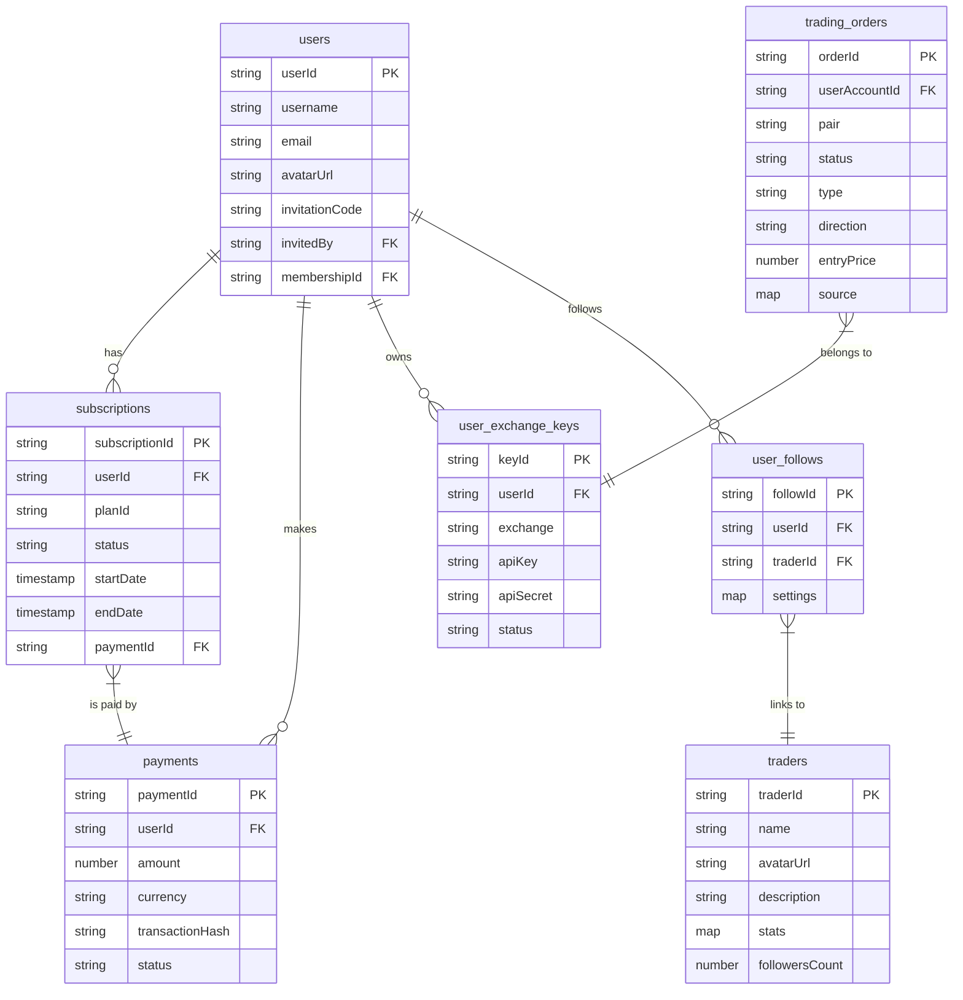
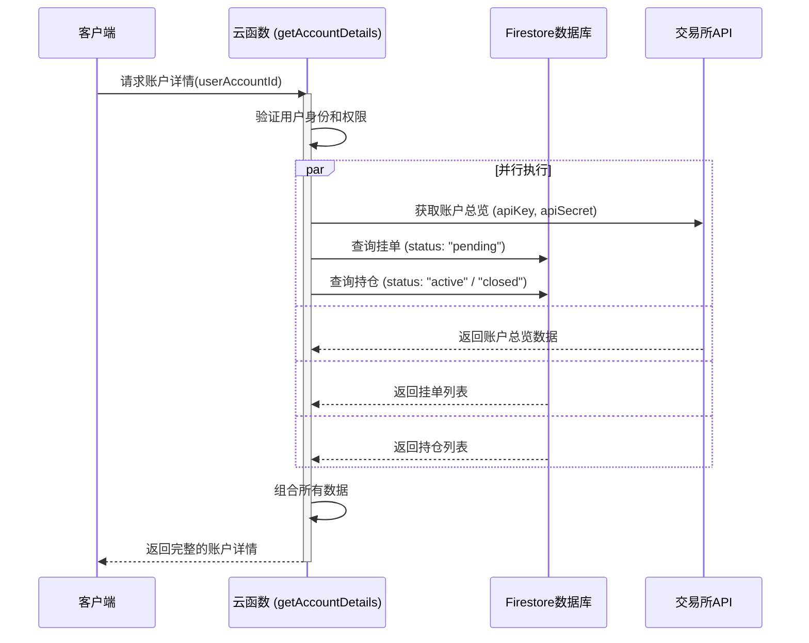

# 技术设计文档：将军令 (SignalAuth) App

本文档旨在为“将军令”应用提供全面的后端技术设计方案，涵盖数据库选型、库表结构设计，以及 API 接口功能设计。

---

## 1. 数据库设计

### 1.1. 数据库选型

考虑到应用的业务场景（高频读写、用户关系复杂、需要实时数据同步）以及未来对 AI 功能的深度集成需求，我推荐使用 **Google Cloud Firestore**。

**选择理由**:

- **完全托管与弹性伸缩**: Firestore 是一个 Serverless NoSQL 文档数据库，能根据流量自动扩缩容，无需担心运维。
- **实时数据同步**: 内置的实时监听器 (real-time listeners) 能轻松实现交易信号、持仓状态等数据的实时更新，完美匹配应用的金融场景。
- **灵活的数据模型**: 文档型结构非常适合存储用户资料、交易信号等半结构化数据，便于未来快速迭代和扩展字段。
- **强大的查询能力**: 支持复杂的复合查询和数据聚合，能满足排行榜、历史记录筛选等各类需求。
- **与 Firebase 生态无缝集成**: 能与 Firebase Authentication, Cloud Functions 等服务紧密结合，简化开发流程。

### 1.2. 库表结构设计 (Firestore Collections)

我将 Firestore 的 `Collection` 视为关系型数据库中的 `Table` 来进行设计。

#### 1.2.1. `users` - 用户表

存储应用用户的核心信息。

| 字段名 | 数据类型 | 描述 | 示例 |
| :--- | :--- | :--- | :--- |
| `userId` | `string` | **主键**。通常使用 Firebase Auth UID。 | `abcde12345` |
| `username` | `string` | 用户名，唯一。 | `CryptoKing` |
| `email` | `string` | 邮箱，用于登录或通知。 | `user@example.com` |
| `avatarUrl` | `string` | 用户头像图片的 URL。 | `https://.../avatar.png` |
| `invitationCode` | `string` | 用户的邀请码，唯一。 | `INVT8888` |
| `invitedBy` | `string` | 邀请者的 `userId` (外键)。 | `fghij67890` |
| `membershipId` | `string` | 当前生效的会员订阅ID (外键)。 | `sub_xyz789` |
| `createdAt` | `timestamp` | 账户创建时间。 | `2023-10-27T10:00:00Z` |

#### 1.2.2. `traders` - 交易员表

存储交易信号提供者的详细信息和统计数据。

| 字段名 | 数据类型 | 描述 | 示例 |
| :--- | :--- | :--- | :--- |
| `traderId` | `string` | **主键**。 | `trader_woods` |
| `name` | `string` | 交易员名称。 | `WWG-Woods` |
| `avatarUrl` | `string` | 交易员头像 URL。 | `https://.../woods.png` |
| `description`| `string` | 个人简介。 | `盈亏同源高收益...` |
| `tags` | `array<string>` | 风格标签。 | `["波段高手", "高频交易"]` |
| `stats` | `map` | 统计数据 (为便于查询和更新，聚合存放)。 | `{ "yield": 288.0, "winRate": 95.0, ... }` |
| `followersCount`| `number` | 跟单人数 (冗余字段，用于快速读取)。 | `1288` |

#### 1.2.3. `subscriptions` - 用户订阅表

记录用户的会员购买与有效期限。

| 字段名 | 数据类型 | 描述 | 示例 |
| :--- | :--- | :--- | :--- |
| `subscriptionId`|`string`| **主键**。 | `sub_xyz789` |
| `userId` | `string` | 用户ID (外键)。 | `abcde12345` |
| `planId` | `string` | 订阅的套餐ID (如 `auto-yearly`)。 | `auto-yearly` |
| `status` | `string` | 订阅状态 (`active`, `expired`, `cancelled`)。 | `active` |
| `startDate` | `timestamp` | 订阅开始时间。 | `2023-10-27T...` |
| `endDate` | `timestamp` | 订阅结束时间。 | `2024-10-27T...` |
| `paymentId` | `string` | 关联的支付记录ID (外键)。 | `pay_123abc` |

#### 1.2.4. `payments` - 支付记录表

存储所有支付行为的详细信息。

| 字段名 | 数据类型 | 描述 | 示例 |
| :--- | :--- | :--- | :--- |
| `paymentId`| `string`| **主键**。 | `pay_123abc` |
| `userId` | `string`| 用户ID (外键)。 | `abcde12345` |
| `amount` | `number`| 支付金额。 | `240.0` |
| `currency` | `string`| 支付货币 (如 USDT)。 | `USDT` |
| `paymentMethod`| `string`| 支付方式 (`TRC20`, `ERC20`)。 | `TRC20` |
| `transactionHash`| `string`| 链上交易哈希。 | `0x...` |
| `status` | `string`| 支付状态 (`pending`, `completed`, `failed`)。 | `completed` |
| `createdAt` | `timestamp`| 记录创建时间。 | `2023-10-27T...` |

#### 1.2.5. `user_exchange_keys` - 用户API密钥表

安全地存储用户绑定的交易所 API 密钥。

| 字段名 | 数据类型 | 描述 | 示例 |
| :--- | :--- | :--- | :--- |
| `keyId` | `string` | **主键**。 | `key_okx_1` |
| `userId` | `string` | 用户ID (外键)。 | `abcde12345` |
| `exchange` | `string` | 交易所名称 (`okx`, `binance`)。 | `okx` |
| `apiKey` | `string` | API Key (**必须加密存储**)。 | `encrypted:...` |
| `apiSecret`| `string` | API Secret (**必须加密存储**)。 | `encrypted:...` |
| `passphrase`| `string` | Passphrase (如有, **必须加密存储**)。 | `encrypted:...` |
| `status` | `string` | 密钥状态 (`running`, `stopped`)。 | `running` |

#### 1.2.6. `user_follows` - 用户关注关系表

记录用户与交易员的关注关系及跟单设置。

| 字段名 | 数据类型 | 描述 | 示例 |
| :--- | :--- | :--- | :--- |
| `followId` | `string` | **主键** (`userId_traderId`)。 | `abcde12345_trader_woods` |
| `userId` | `string` | 用户ID (外键)。 | `abcde12345` |
| `traderId` | `string` | 交易员ID (外键)。 | `trader_woods` |
| `settings` | `map` | 用户的个性化跟单设置。 | `{ "fundStrategy": "ratio", "amount": 100, ... }` |
| `createdAt`| `timestamp`| 关注开始时间。 | `2023-10-28T...` |

#### 1.2.7. `trading_orders` - 交易订单表

记录所有挂单和持仓信息，是应用的核心数据表。

| 字段名 | 数据类型 | 描述 | 示例 |
| :--- | :--- | :--- | :--- |
| `orderId` | `string` | **主键**。 | `ord_btc_123` |
| `userAccountId` | `string`| 用户的交易所账户ID (关联`user_exchange_keys`)。| `okx-10001`|
| `pair` | `string`| 交易对。 | `BTC/USDT` |
| `status` | `string`| 订单状态 (`pending`, `active`, `closed`, `cancelled`)。|`active`|
| `type` | `string`| 订单类型 (`position`, `limit_order`)。 | `position` |
| `direction`| `string`| 交易方向 (`long`, `short`)。 | `long` |
| `entryPrice` | `number`| 开仓/委托价格。 | `68000.50` |
| `closePrice` | `number`| 平仓价格 (如有)。 | `69000.00` |
| `size` | `number`| 仓位/委托数量。 | `0.1` |
| `pnl` | `number`| 已实现/未实现盈亏。 | `120.50` |
| `pnlRate`| `number`| 盈亏率。 | `5.19` |
| `source` | `map` | 信号来源信息。 | `{ "type": "auto", "traderId": "trader_woods" }` |
| `openTime` | `timestamp`| 开仓/挂单时间。 | `2023-10-28T...` |
| `closeTime`| `timestamp`| 平仓/撤销时间 (如有)。 | `2023-10-29T...` |

### 1.3. 数据库实体关系图 (ER Diagram)



---

## 2. API 接口设计

### 2.1. 技术选型

推荐使用 **Google Cloud Functions for Firebase**，并采用 TypeScript 编写，以确保类型安全和代码质量。

### 2.2. 接口功能详情

#### 2.2.1. 用户模块 (`user`)

- **`getUserProfile()` - 获取用户资料**
  - **描述**: 获取当前登录用户的完整个人信息，包括会员状态。
  - **触发方式**: HTTP (Callable Function)
  - **入参**: 无 (用户身份通过 context.auth 获取)。
  - **出参**:
    ```json
    {
      "success": true,
      "data": {
        "userId": "abcde12345",
        "username": "CryptoKing",
        "avatarUrl": "https://...",
        "invitationCode": "INVT8888",
        "membership": {
          "planName": "自动跟单 · 1年",
          "expiresAt": "2024-10-27T..."
        }
      }
    }
    ```
  - **内部逻辑**:
    1. 验证用户登录状态。
    2. 从 `users` 表查询用户信息。
    3. 根据 `membershipId` 联查 `subscriptions` 表，获取会员信息。
    4. 组合数据并返回。

- **`updateUserProfile()` - 更新用户资料**
  - **描述**: 允许用户更新自己的用户名、头像等信息。
  - **触发方式**: HTTP (Callable Function)
  - **入参**:
    ```json
    {
      "username": "CryptoKing_New",
      "avatarUrl": "https://.../new.png"
    }
    ```
  - **出参**: `{ "success": true, "message": "Profile updated successfully." }`
  - **内部逻辑**:
    1. 验证用户登录状态。
    2. 校验入参（如用户名是否已存在）。
    3. 更新 `users` 表中对应用户的字段。

#### 2.2.2. 交易员与榜单模块 (`trader`)

- **`getTraderLeaderboard()` - 获取交易员榜单**
  - **描述**: 获取交易员列表，支持分页和多种排序方式。
  - **触发方式**: HTTP (Callable Function)
  - **入参**:
    ```json
    {
      "sortBy": "yield",
      "direction": "desc",
      "pageSize": 10,
      "page": 1
    }
    ```
  - **出参**:
    ```json
    {
      "success": true,
      "data": {
        "traders": [
          { "traderId": "trader_woods", "name": "WWG-Woods", "stats": {...} }
        ],
        "hasMore": true
      }
    }
    ```
  - **内部逻辑**:
    1. 根据 `sortBy` 和 `direction` 参数，构建 Firestore 查询。
    2. 使用 `limit()` 和 `startAfter()` 实现分页。
    3. 查询 `traders` 表并返回列表。

#### 2.2.3. 跟单与交易模块 (`trade`)

- **`getAccountDetails()` - 获取指定账户的资产和订单**
  - **描述**: 获取用户单个交易所账户的总览数据、挂单列表和持仓列表。
  - **触发方式**: HTTP (Callable Function)
  - **入参**:
    ```json
    {
      "userAccountId": "okx-10001"
    }
    ```
  - **出参**:
    ```json
    {
      "success": true,
      "data": {
        "overview": { "totalAssets": 88238.39, "pnl": 54.00 },
        "pendingOrders": [ { "orderId": "..." } ],
        "positions": [ { "orderId": "..." } ]
      }
    }
    ```
  - **内部逻辑**:
    1. 验证用户身份及其对 `userAccountId` 的所有权。
    2. **异步并行执行**：
       a. 调用交易所真实 API，获取账户总览数据。
       b. 查询 `trading_orders` 表，获取 `status` 为 `pending` 的挂单。
       c. 查询 `trading_orders` 表，获取 `status` 为 `active` 或 `closed` 的持仓。
    3. 组合所有数据并返回。

- **`setFollowTrader()` - 设置跟单**
  - **描述**: 创建或更新用户对某个交易员的跟单设置。
  - **触发方式**: HTTP (Callable Function)
  - **入参**:
    ```json
    {
      "traderId": "trader_woods",
      "settings": {
        "userAccountId": "okx-10001",
        "fundStrategy": "ratio",
        "amount": 100,
        "pairs": [ { "pair": "BTC/USDT", "leverage": 20 } ]
      }
    }
    ```
  - **出参**: `{ "success": true, "message": "Follow settings saved." }`
  - **内部逻辑**:
    1. 验证用户登录状态和会员资格。
    2. 使用 `upsert` (更新或插入) 逻辑，在 `user_follows` 表中创建或更新记录。

#### 2.2.4. API 密钥管理模块 (`apiKey`)

- **`addExchangeApiKey()` - 新增/修改API密钥**
  - **描述**: 用户绑定或修改自己的交易所API密钥。
  - **触发方式**: HTTP (Callable Function)
  - **入参**:
    ```json
    {
      "exchange": "okx",
      "apiKey": "...",
      "apiSecret": "...",
      "passphrase": "..."
    }
    ```
  - **出参**: `{ "success": true, "keyId": "key_okx_1", "message": "API key saved securely." }`
  - **内部逻辑**:
    1. 验证用户登录状态。
    2. **关键安全步骤**: 使用 Google Cloud KMS 或 Secret Manager 对 `apiKey`, `apiSecret`, `passphrase` 进行加密。
    3. 将加密后的数据存入 `user_exchange_keys` 表。
    4. 返回新创建的 `keyId`。

### 2.3. 接口调用时序图 (Sequence Diagram)

以 `getAccountDetails` 为例，展示其调用流程。


